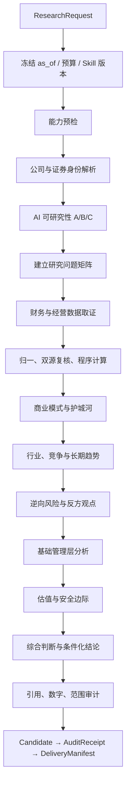

# AI 公司研究：业务架构与公共 Agent 模板接入设计

> 版本：v1.0 · 日期：2026-09-15 · 文档性质：业务领域设计  
> 依赖文档：[AI Agent 通用模板：技术设计与实现规范 v1.0](AI-Agent通用模板_技术设计与实现规范_v1.0.md)  
> 参考方法：`xbtlin/ai-berkshire` 固定提交 `43fbaed85af8b88ce233b263e7c76c8a953ae380`  
> 范围：AI 分析内核；不包含前端、HTTP 服务、部署平台、账户体系和交易执行

---

## 1. 当前决策与文档定位

### 1.1 已确认决策

| 项目 | 当前决策 |
|---|---|
| 代码落点 | 在当前 `ai-agent-roadmap` 中新增独立 Python 模块 |
| 第一版市场 | A 股、中国香港上市公司 |
| 核心框架 | LangGraph + LangChain |
| 原生搜索基线 | 现有 DeepSeek 原生 WebSearch 方向 |
| 第一阶段 | 先做 `standard_p0` 最小研究闭环，再扩展完整标准研究、团队和管理层专项 |
| 财务核验 | 官方原文 + 独立复核；必须披露来源是否同源，不把镜像当两次独立事实观察 |
| 方法参考 | ai-berkshire 提供研究方法、提示词和辅助脚本；运行框架使用本项目公共 Agent 模板 |
| 预算 | 尚未最终确定；模板支持 hard/soft 两种策略，实际运行前必须选择 |

### 1.2 本文解决的问题

- 把 ai-berkshire 的三种研究能力翻译成可执行的业务 Skill 和 LangGraph 子图。
- 明确标准研究、四角色团队研究、管理层纵深研究的输入、阶段、输出和准出条件。
- 规定 WebSearch、原文读取、证据、财务数据、计算和报告审计如何串起来。
- 说明业务如何接入公共模板，而不是重新实现 Plan、Retry、Langfuse 和 checkpoint。
- 区分 P0 最小闭环与最终完整需求，避免简版报告被误认为完整投研报告。

---

## 2. ai-berkshire 的迁移边界

### 2.1 上游仓库是什么

ai-berkshire 是 Claude Code/Codex 兼容的投研 Skill 集合，核心目录为：

```text
skills/*.md              研究方法与执行提示词
codex-skills/*/SKILL.md  Codex 兼容产物
codex-prompts/*.md       Prompt 兼容层
tools/*.py               财务计算、报告抽检等辅助脚本
reports/                 历史研究产物
```

它不是 LangGraph 运行时。上游的 `Task`、后台 Agent、Team、Bash 等是宿主环境能力，不能原样作为业务代码依赖。

本项目的迁移方式：

```text
ai-berkshire 方法规则
       ↓ 提取为 Skill / Policy / Schema
公共 Agent 模板
       ↓ LangGraph 图、LangChain 模型、Checkpoint、Langfuse
公司研究业务模块
       ↓
标准研究 / 团队研究 / 管理层研究
```

### 2.2 固定参考版本

- GitHub：<https://github.com/xbtlin/ai-berkshire>
- 固定提交：`43fbaed85af8b88ce233b263e7c76c8a953ae380`
- License：MIT
- 规范源优先：`skills/*.md`；不重复导入生成的 Codex 兼容文件。

### 2.3 必须修正的上游规则

1. 上游文字规范要求关键数据双源，但 `tools/financial_rigor.py` 的默认交叉验证使用中位数和 `tolerance_pct=2.0`；业务模块重新定义指标口径和阈值版本。
2. 上游部分数据源优先级以聚合站为主，不足以覆盖全部 A/H 公司；本项目优先原始公告/年报/交易所，再用第二渠道独立复核。
3. 上游 `report_audit.py` 主要负责抽取与判决，实际复核值仍依赖外部取证；不能把脚本运行结果当作自动事实证明。
4. 上游的十年终值和 r/g 规则是特定投资方法，不放进公共 Runtime；若接入，作为独立 `valuation_policy` 版本。
5. “大师视角”是方法标签，不生成或伪造真实人物语录。
6. 资料多不等于投资确定性高；资料少也不自动等于公司质量差。

---

## 3. 公司研究能力地图

```text
公司研究
├─ standard_company_research
│    ├─ 标准化单 Agent 研究
│    └─ 适用于普通上市公司研究
├─ investment_team
│    ├─ Team Lead / Manager
│    ├─ Business Analyst
│    ├─ Financial Analyst
│    ├─ Industry Researcher
│    └─ Risk & Management Assessor
└─ management_deep_dive
     ├─ 关键人物识别
     ├─ 战略判断与承诺兑现
     ├─ 资本配置
     ├─ 治理与利益相关方
     └─ 接班人风险
```

### 3.1 三种模式对照

| 维度 | standard | investment-team | management-deep-dive |
|---|---|---|---|
| 目标 | 判断是不是好生意、是否值得继续研究 | 多角色独立研究并会审 | 研究管理层是否值得长期托付 |
| 执行 | 一个主研究图，阶段串行，缺口有限补检索 | 四个独立角色子图并行，Lead 汇总 | 四路管理层证据采集，再结构化评估 |
| 上下文 | 主图按阶段累积证据 | 角色私有上下文；共享身份与原文快照 | 采集角色私有上下文，最终形成管理层账本 |
| 关键产物 | 标准研究报告 | 四份角色报告、冲突、综合报告 | 人物地图、承诺账本、资本配置记录、管理层报告 |
| 预算 | 中 | 高 | 中高 |
| P0 | `standard_p0` | 不实现，只预留接口 | 不实现，只定义契约 |

---

## 4. 标准研究业务流程

### 4.1 完整目标流程



### 4.2 研究前置：AI 可研究性

必须先评估信息覆盖，不把“可研究性”当作公司质量：

| 等级 | 典型特征 | 研究策略 |
|---|---|---|
| A | 上市时间长、原始披露多、独立材料较丰富 | 重点寻找反共识、被忽视的风险和市场已定价部分 |
| B | 有基础披露但部分指标需推导/复核 | 推算字段逐项标注依据、置信度和口径 |
| C | 新上市、冷门、披露稀疏或来源难读 | 转第一性原理：客户、付费原因、替代、复制难度和管理层行为；不追求完整表格 |

报告必须同时输出：

- AI 分析置信度：来自资料覆盖、来源质量、推算比例和冲突数量。
- 实际投资确定性：来自商业模式、竞争优势、财务质量和估值，不由资料数量直接决定。
- 已验证事实、有据推算、观点、信息缺失。

### 4.3 标准研究的业务阶段契约

| 阶段 | 输入 | 产物 | 进入下一阶段条件 |
|---|---|---|---|
| identity | 公司原始查询、市场提示 | CompanyIdentity、SecurityIdentity | 主体、代码、市场、股份类别无歧义 |
| researchability | 身份、来源覆盖 | ResearchabilityAssessment | 等级和理由已记录 |
| data_collection | 问题矩阵、来源策略 | DocumentSnapshot、Evidence、MetricObservation | 重要问题有取证结果或缺口 |
| verification | 指标观测、口径策略 | VerifiedMetric、ConflictSet、CalculationRecord | 关键冲突处理或显式降级 |
| business_analysis | 证据包、商业 Skill | BusinessSection、Claim | 每条事实可回 Evidence |
| risk_analysis | 风险问题、反方搜索结果 | RiskSection、CounterEvidence | 关键假设有反证检查 |
| valuation | 已核验指标、批准假设 | ValuationRecord | 计算适用且可复算；否则 not_assessable |
| synthesis | 各节、冲突、缺口 | CandidateReport | 不生成无来源数字 |
| audit | CandidateReport、依赖 hash | AuditReceipt | 引用/数字/范围门禁通过或明确 partial |
| finalize | candidate + receipt | DeliveryManifest | 交付状态与报告 hash 一致 |

---

## 5. `standard_p0` 第一阶段业务范围

### 5.1 P0 做什么

先用一家 A 股或中国香港上市公司跑通：

1. 公司/证券身份解析。
2. 最新已公开完整财年和上一可比期间的少量核心数据。
3. 官方原始披露 + 独立复核来源。
4. 一句话商业模式和基础风险/反证。
5. 少量可复算指标：收入同比、利润率、自由现金流代理或市值快照（能取得且口径匹配时）。
6. 证据引用、计算记录、简版报告、checkpoint 恢复和 Langfuse trace。

### 5.2 P0 不做什么

- 不承诺完整五年趋势。
- 不承诺所有公司都有完整四季度数据。
- 不在第一阶段实现四角色团队。
- 不在第一阶段实现管理层十项纵深评估。
- 不默认输出具体买入价、仓位或卖出决策。
- 不把缺失数据用模型推测填满。

### 5.3 P0 结果状态

```text
profile: standard_p0
result_quality: complete | partial | blocked
full_mode_coverage: partial
investment_decision: not_assessable
```

P0 的 `complete` 只表示 P0 已声明范围完成，不表示完整公司研究完成。报告开头必须写清范围，结尾必须列出升级到完整 standard 所需的缺口。

### 5.4 P0 的实际验收

- 真实搜索执行事件可观察。
- 原始响应和来源 URL 已保存。
- 核心数字有官方原文、独立复核状态、期间/币种/口径。
- 报告中的数字可回到 `MetricObservation` 或 `CalculationRecord`。
- 进程中断后可以从 checkpoint 继续。
- 供应商响应已保存但 checkpoint 未保存时，不重复请求。
- 请求结果未知时不盲目重发。
- Langfuse 不可用不会破坏证据和 checkpoint；若发布策略要求观测，则由门禁阻断交付。

---

## 6. 业务 Skill 规范

### 6.1 Skill 与 Graph 的关系

```text
Skill：研究方法、问题、规则、输出 schema
Graph：什么时候做、失败去哪、是否暂停、如何恢复
Tool：执行搜索、读取、计算、存取证据
Policy：来源、预算、指标、准出和安全策略
```

Skill 不直接创建 Agent，不直接执行 shell，不直接选择任意 URL，不自行绕过公共 Runtime 的预算和权限。

### 6.2 三个业务 Skill

```text
skills/investment-research/
  SKILL.md
  manifest.yaml
  references/standard-outline.md

skills/investment-team/
  SKILL.md
  manifest.yaml
  references/team-roles.md

skills/management-deep-dive/
  SKILL.md
  manifest.yaml
  references/management-ledger.md

skills/shared/
  source-policy.yaml
  metric-policy.yaml
  evidence-policy.yaml
  report-policy.yaml
```

### 6.3 `investment-research` 的核心规则

- 开始先做 A/B/C 信息丰富度评估。
- 财务数据必须有来源、期间、单位、币种、会计口径。
- 关键数据采用官方原文 + 独立复核；同源镜像只算一次原始来源。
- 数值用确定性计算，不让模型心算市值、PE、ROE、FCF Yield 或 DCF。
- 每个核心判断都要求支持证据和反方/未解决状态。
- 需要具体估值时，当前价格/股本/现金流必须通过时间和口径门禁。
- 信息缺失时输出 gap，不编造“合理估计”。

### 6.4 `investment-team` 的核心规则

- Team Lead 负责拆分、预算、会审和交付，不代替四个角色首轮取证。
- Business Analyst：商业模式、用户价值、护城河。
- Financial Analyst：财务、现金流、估值和程序验算。
- Industry Researcher：行业、市场份额、竞争、替代和政策。
- Risk & Management Assessor：管理层、治理、监管、竞争和长期风险。
- 四个角色各有私有 context、query history、evidence refs、attempt IDs。
- 汇总只接受当前 attempt 的结果；过期结果不能覆盖新结果。
- 事实冲突先核口径；解释冲突保留；假设冲突做敏感性分析；禁止多数投票取代证据。
- 任一角色失败时，报告只能 partial/blocked，不伪装“四角色已完成”。

### 6.5 `management-deep-dive` 的核心规则

研究对象是关键决策者，不只是职位名称：CEO、董事长、创始人、实控人、CFO、关键业务负责人和卸任但仍有影响力的人物。

固定账本：

```text
Promise:
  promise_id / person_id / stated_at / deadline
  source_evidence_id / source_quote
  promised_metric / target_value
  outcome_metric_id / result_status

CapitalAllocationEvent:
  event_id / event_type / announced_at / amount / currency
  rationale_evidence_ids / result_evidence_ids / evaluation
```

承诺兑现规则：

- 只有到期且可判断的承诺进入兑现率分母。
- 完全兑现率：`fulfilled / (fulfilled + partially_fulfilled + not_fulfilled)`。
- 部分兑现单独展示，不移出分母，不默认赋 0.5。
- 没有到期且可判断承诺时返回 null，不输出 0% 或 100%。
- 员工评价、客户投诉和匿名材料是侧面线索，不能单独判定诚信失格。
- 诚信、战略执行、资本配置、治理的默认权重沿用上游 35/25/25/15，但权重属于 Skill policy，不是公共 Runtime 逻辑。

---

## 7. 市场身份与数据口径

### 7.1 公司和证券必须拆开

```text
CompanyIdentity:
  company_id / legal_name / common_names / incorporation_info

SecurityIdentity:
  security_id / exchange / market / ticker
  share_class / currency / listing_status
```

公司财务、证券价格、股份类别和企业总权益不能用一个 ticker 字符串混合处理。A 股与中国香港同一企业可能存在多地上市、不同股类或不同流通口径。

### 7.2 A 股与中国香港首批来源

| 市场 | 一手/权威入口 | 独立复核候选 | 规则 |
|---|---|---|---|
| A 股 | 巨潮资讯 <https://www.cninfo.com.cn/>；上交所/深交所官方披露；公司 IR | 东方财富等公开财务平台 | 先匹配公司全称/代码/公告期间，再取数 |
| 中国香港 | 港交所披露易 <https://www.hkexnews.hk/>；公司 IR | AASTOCKS 等公开财务平台 | 先确认产品是普通股份，不把 ETF/杠杆产品混入 |

来源首页只是入口。最终 Evidence 必须保存具体公告、年报、表格或页面 URL，以及出版时间/获取时间。

### 7.3 官方原文 + 独立复核的含义

本项目当前采用实用但明确的准出策略：

- **官方原文**确认法律披露、公司报表和管理层原话。
- **独立复核**核对数字、抽取和口径；若复核方实际转载同一公告，标记 `shared_origin`，不能当作第二次独立事实观察。
- 来源谱系未知时不计入独立来源数。
- 官方原文存在但没有独立复核时，可以作为 partial 草稿事实；关键估值和具体操作价格不准以 complete 状态交付。
- 若后续确认“官方原文 + 独立抽取复核”作为正式充分验证，必须升级 `metric_policy` 版本并在报告中写明其验证边界。

### 7.4 时间约束

- `as_of` 在第一次联网前冻结。
- `publication_time` 决定一条证据在该 as_of 是否可用，不能只看财报覆盖期间。
- 后发更正公告是新版本；历史时点研究不能把后发信息倒灌。
- “最新”取最近已公开且有效的资料，不把当前年份直接当作最新完整财年。
- 港股/公司是否披露季度数据需按实际公告确认；没有四个季度就标 `not_disclosed`，不除以二补数据。

---

## 8. WebSearch 与原文取证规范

### 8.1 当前基线

第一版以现有 `demo/deepseek_websearch.py` 的 DeepSeek Anthropic 兼容搜索方向作为候选适配器。已有 demo 能识别：

- `server_tool_use`。
- `web_search_tool_result`。
- 搜索结果的 title、url、page_age。
- `tool_use_id` 和服务端调用结构。

它还不是完整证据管线。业务模块必须通过公共 `NativeSearchAdapter` 记录真实搜索、raw response、来源候选、工具错误、引用和续接状态。

### 8.2 搜索成功的三层判断

```text
HTTP/API 成功
  ≠ 真实搜索已执行
  ≠ 来源证据可用
```

每次搜索至少判断：

1. 传输层成功。
2. 响应中观察到真实 WebSearch 执行记录，且无未处理工具错误。
3. 返回来源与片段满足当前 `ResearchQuestion`，并可读取或降级标记。

只有第三层通过，才能把 Evidence 标成 `usable`。

### 8.3 查询生成

查询必须对应一个具体研究问题，不写“全面分析某公司”这种无边界请求：

```text
query = company identity
       + target period
       + expected evidence type
       + approved source/domain intent
       + counter-evidence intent（如适用）
```

示例意图：

- 查 A 股公司 2025 年年度报告中的分部收入和经营利润。
- 查中国香港上市公司 2025 年年报中的现金、债务与自由现金流相关披露。
- 查某管理层在指定期间的公开承诺及其到期结果。
- 查核心投资假设的竞争、监管或替代反证。

### 8.4 搜索与原文读取分开

```text
NativeSearch
  → SearchStepResult
  → DocumentSnapshot
  → Evidence(locator, quote, hash)
  → MetricObservation / Claim
```

搜索摘要可支持简单事实，但关键财务数字优先读取官方公告/年报原文。原文不可访问时只能输出 `snippet_only` 或 `unreadable`，不能宣称读过全文。

### 8.5 WebSearch 失败处理

| 情况 | 业务结果 |
|---|---|
| 配置缺失/未授权 | `blocked_configuration`，不生成联网完整报告 |
| HTTP 200 + tool error | 保存 raw，分类错误，不视为搜索成功 |
| 搜索无结果 | 有限改写查询，仍为空则 gap |
| `pause_turn`/供应商续接 | 保存 opaque continuation，按新交换续接 |
| 发送后读超时 | `unknown_external_result`，对账或人工确认 |
| 只有模型声称“已搜索” | `search_not_verified` |
| 来源只返回聚合摘要 | 可作线索，关键事实需原文或降级 |

兼容端点不等于完整实现 Anthropic/OpenAI 的所有原生搜索字段。具体 provider/model/tool_version 的能力必须写入 CapabilityProfile 并实际验收。

---

## 9. 财务指标和程序计算

### 9.1 MetricObservation

```text
metric_code / value / raw_value / unit / currency
company_id / security_id / period_start / period_end / fiscal_label
accounting_basis / consolidation_scope / adjustment_basis
evidence_ids / publication_time / retrieved_at / extraction_version
```

任何指标缺少期间、单位、币种、会计口径或证据，都不能进入 `VerifiedMetric`。

### 9.2 P0 计算范围

```text
revenue_yoy
net_margin
fcf_proxy
quote_market_cap（如果证券价格和股本同口径可得）
pe_snapshot（EPS>0 且时间/股类/口径匹配时）
```

模型只提出计算需要的字段；代码执行命名公式并保存 `CalculationRecord`。禁止 `eval`、自由 Python 或模型心算。

### 9.3 估值扩展

完整 standard 需要：

- 当前 PE/PS/PB/EV 等适用性判断。
- 历史估值对齐期间与口径。
- 同业比较。
- 反向 DCF。
- 悲观/中性/乐观情景。
- 假设、敏感性、未建模离散风险。

这些属于 P1/P2。只有在价格、股本、财务指标和币种都可验证时才输出具体价格区间；否则返回 `not_assessable`。

---

## 10. investment-team 接入公共 Multi-Agent

### 10.1 角色与公共边界映射

| 业务角色 | 公共角色基础 | 允许工具方向 | 主要输出 |
|---|---|---|---|
| Team Lead | manager | 默认无搜索工具；读取已登记证据/结果 | 计划、分歧、会审、综合结论 |
| Business Analyst | researcher | search、read_source、extract | 商业模式、用户价值、护城河 |
| Financial Analyst | researcher + calculator | search、read_source、calculate | 财务、现金流、估值、核验记录 |
| Industry Researcher | researcher | search、read_source、extract | 行业、竞争、替代、政策 |
| Risk & Management | researcher | search、read_source、extract | 风险、治理、管理层、长期确定性 |
| Independent Reviewer | tester/verifier | read_evidence、verify_claim | 事实/引用/口径/计算复核 |

### 10.2 团队图

```text
preflight
  → identity / researchability
  → team_plan
  → [business_subgraph]
  → [financial_subgraph]
  → [industry_subgraph]
  → [risk_subgraph]
  → join
  → reconcile_facts
  → resolve_conflicts / targeted_review
  → recompute_valuation
  → lead_synthesis
  → audit
```

四个角色首轮共用：

- 公司/证券身份。
- as_of 和市场口径。
- Skill 版本和预算上限。
- 不可变的已登记原始文档快照。

四个角色不共用：

- 全部 messages。
- 其他角色未审计的结论。
- 其他角色的 query history 作为自己的搜索证明。

### 10.3 会审规则

- **事实冲突**：比较期间、币种、单位、GAAP/IFRS、合并范围、更新时间。
- **解释冲突**：保留多种解释和各自 Evidence。
- **假设冲突**：重跑情景/敏感性，不求平均。
- **无法消除的冲突**：报告 `unresolved_conflicts`，不强行生成单一结论。
- **财务假设变化**：必须让确定性计算节点重新计算，Lead 不能直接修改估值文本。

### 10.4 团队模式的失败结果

- 一个角色未完成：`partial`，列出缺失角色和已完成角色。
- 财务角色失败但其他角色完成：禁止输出具体估值和操作价格。
- 证据版本过期：丢弃旧 claim，不用最后到达结果覆盖。
- 团队 Lead 失败：保留四个角色产物，允许新 revision 只重做汇总。
- 预算耗尽：停止新增搜索，交付已得证据和明确缺口。

---

## 11. management-deep-dive 接入公共 Plan/Multi-Agent

### 11.1 建议图

```text
identify_key_people
  → [public_statements]
  → [promise_results]
  → [capital_allocation]
  → [governance_compensation]
  → [stakeholder_signals]
  → normalize_person_and_event
  → evaluate_strategy_execution
  → evaluate_integrity
  → evaluate_capital_allocation
  → evaluate_governance
  → succession_risk
  → weighted_score + veto_gate
  → audit + report
```

并行采集可以用公共 Multi-Agent；最终评分和 veto 必须是确定性规则 + 证据约束的分析节点。

### 11.2 诚信一票否决的工程边界

“诚信一票否决”只能表示：存在充分、可追溯且与主体匹配的重大诚信证据时，阻断正向长期托付结论；不表示模型看到一条匿名帖子就能判定人物不诚信。

必须区分：

- 已验证事实。
- 管理层自述。
- 具名第三方评价。
- 匿名/社交线索。
- 尚未核实的指控。

### 11.3 评分缺失

- 分母为零或样本不足时返回 null/needs_review。
- 缺失维度不自动补 3 分，不静默重新分配权重。
- 权重、样本门槛和 veto 规则都写入 Skill policy hash。

---

## 12. 报告与业务交付契约

### 12.1 标准报告

```text
范围、as_of、P0/完整模式状态
公司和证券身份
信息丰富度评级与 AI 局限
一句话商业模式
财务事实与口径
商业模式与护城河
行业与竞争
管理层基础分析
逆向风险、Bull vs Bear
估值与安全边际（适用时）
条件化结论与不可回答项
数据缺口、来源、计算、审计记录
```

### 12.2 团队报告

```text
一句话结论
四维评分与评分依据
核心数据
四个角色主要发现
共识、事实冲突、解释冲突、关键分歧
Bull vs Bear
Checklist
条件化建议和触发信号
独立核验、审计与缺口
```

### 12.3 管理层报告

```text
关键人物地图
战略判断—结果记录
承诺账本和兑现率/覆盖率
困难时期表现
资本配置记录
治理、薪酬、关联交易
员工/客户/供应商/同行侧面线索
接班人风险
加权评分、veto、是否可长期托付
证据与局限
```

### 12.4 报告产物关系

```text
CandidateReport (content_hash)
        ↓
AuditReceipt (target_report_hash)
        ↓
DeliveryManifest (report_hash + audit_hash + result_quality)
```

审计回执不回写 CandidateReport，避免审计摘要导致报告 hash 自引用。报告发生任何数字、引用或范围变化，都必须产生新 revision 并重新审计。

如最终输出包含具体买卖或价格判断，必须附固定免责声明；但 P0 默认 `investment_decision=not_assessable`。

---

## 13. 业务模块建议目录

```text
research-agent/
  src/research_agent/
    business/
      company_identity.py
      researchability.py
      evidence.py
      metrics.py
      reports.py
    workflows/
      standard.py
      team.py
      management.py
    skills/
      loader.py
  skills/
    investment-research/
    investment-team/
    management-deep-dive/
    shared/
```

业务模块依赖公共模板接口：

```text
start(request)
inspect(run_id)
continue_run(run_id)
resume(run_id, human_response)
revise_run(parent_run_id, gap_selection)
```

业务模块自行实现：

- 公司身份和证券注册表。
- A 股/中国香港来源策略。
- 财务指标 schema 和计算公式。
- 三个业务 Skill。
- 研究报告渲染与业务准出 policy。

业务模块不自行实现：

- LangGraph checkpoint 生命周期。
- 通用 retry/backoff/reconcile 状态。
- Langfuse trace/span/generation 创建。
- Worker 并发、attempt 聚合和权限边界。
- 通用 Completion Gate 框架。

---

## 14. 实施路线

### B0：先接公共模板的 P0 standard

1. 新建独立 `research-agent` 包。
2. 接入公共 `RunManifest`、Plan/Recovery、Checkpoint、Langfuse Port。
3. 实现 DeepSeek NativeSearchAdapter 候选。
4. 实现 A 股/中国香港身份解析和公开来源读取。
5. 实现 Evidence、MetricObservation、P0 计算。
6. 生成 P0 CandidateReport、AuditReceipt、DeliveryManifest。

**退出条件：**真实搜索可观察、来源可追踪、进程恢复有效、缺口诚实、Langfuse 失败与业务证据失败分开。

### B1：完整标准研究

补齐：五年财务、近期披露、分业务、护城河趋势、行业竞争、管理层基础、反方观点、估值情景和完整准出。

### B2：四角色团队

复用公共 Multi-Agent：四角色私有上下文、并行取证、显式 join、冲突会审、独立核验、Lead 汇总。

### B3：管理层专项

接入人物/承诺/资本配置/治理账本、加权评分、veto 和利益相关方证据。

### B4：供应商与数据源扩展

根据 P0 真实缺口增加第二个原生搜索适配或结构化数据连接器。先做能力验收，再决定是否引入独立搜索 API；不因为“多一个 provider”本身而增加复杂度。

---

## 15. 目前仍需要确认的事项

文档设计已经可以进入代码阶段，但以下事项在真正运行前必须落定：

| 项目 | 当前状态 | 不确认的影响 |
|---|---|---|
| DeepSeek 实际 endpoint/model/tool version | 已选方向，具体配置待确认 | 无法冻结 response parser 和 capability profile |
| Langfuse 运行方式 | 需要确认 Cloud/自托管、Python SDK 版本 | 影响 Callback/observation API、服务端兼容与隐私策略 |
| 预算策略 | 暂未定：hard 或 soft | 影响是否允许未知请求重发和发布门禁 |
| 双源替代政策 | 当前采用官方原文 + 独立复核，需保留同源标记 | 影响关键指标 complete/partial |
| P0 的报告用途 | 默认研究草稿/技术验证，不输出个性化交易决策 | 影响估值和免责声明边界 |
| 特殊行业 | 金融、地产等先不默认纳入通用 P0 | 误用 PE/FCF 可能造成指标错误 |
| A 股交易所覆盖清单 | A 股方向已定，具体连接器/来源注册表待实现 | 未实现的市场不能假装覆盖 |

### 关于预算的建议

文档暂不替用户选择 hard/soft：

- 如果必须严格费用封顶，只允许能证明单次调用消费上界的 provider/profile；否则启动前阻断。
- 如果接受软预算，控制外部请求数、可知 token 和已知费用；达到阈值停止后续调用，unknown 请求先暂停确认，不盲目重发。

---

## 16. 验收清单

### 标准模式

- [ ] 公司名和代码歧义会暂停，不会猜主体。
- [ ] A 股/中国香港身份与股份类别分开保存。
- [ ] `as_of` 在第一次联网前冻结，恢复不改变。
- [ ] WebSearch 真正执行可观察，模型口头声称不算。
- [ ] HTTP 200 工具错误不会进入成功证据。
- [ ] 原始响应、来源 URL、文档 hash、定位和 Evidence 可追溯。
- [ ] 官方原文与独立复核同源关系可见。
- [ ] 关键数字能回到指标或计算记录。
- [ ] `partial` 不被渲染成完整标准研究。

### Plan/Checkpoint

- [ ] 模型生成的计划通过代码 schema 校验。
- [ ] 失败步骤只按错误类型有限重试。
- [ ] 计划被新证据推翻后生成新 plan version。
- [ ] 同 thread `ainvoke(None)` 能恢复未完成图。
- [ ] `Command(resume=...)` 只恢复匹配版本的人工问题。
- [ ] 已结束 partial 通过新 revision 补跑，不靠普通 continue。
- [ ] 外部请求未知时保留预算和对账状态。

### Multi-Agent

- [ ] 角色有明确工具白名单和最小上下文。
- [ ] 共享写入只有一个受控 Writer/Coder。
- [ ] 结果按 task/attempt 去重，旧结果不能覆盖新结果。
- [ ] 多角色冲突保留，不以投票静默消除。
- [ ] 独立验证不能由同一角色自证。

### Langfuse

- [ ] Root trace 与 run/thread/task/attempt 关联。
- [ ] Node、generation、tool、retry、checkpoint、completion 可追踪。
- [ ] trace 不写入密钥和不必要的完整原文。
- [ ] 脱敏在外发前生效，其他日志/Exporter 单独治理。
- [ ] Langfuse 暂时不可用时业务状态仍能正确结束或阻断。

---

## 17. 参考资料

### ai-berkshire 固定源码

- 标准研究：<https://github.com/xbtlin/ai-berkshire/blob/43fbaed85af8b88ce233b263e7c76c8a953ae380/skills/investment-research.md>
- 团队研究：<https://github.com/xbtlin/ai-berkshire/blob/43fbaed85af8b88ce233b263e7c76c8a953ae380/skills/investment-team.md>
- 管理层专项：<https://github.com/xbtlin/ai-berkshire/blob/43fbaed85af8b88ce233b263e7c76c8a953ae380/skills/management-deep-dive.md>
- 财务数据规则：<https://github.com/xbtlin/ai-berkshire/blob/43fbaed85af8b88ce233b263e7c76c8a953ae380/skills/financial-data.md>
- 财务验算：<https://github.com/xbtlin/ai-berkshire/blob/43fbaed85af8b88ce233b263e7c76c8a953ae380/tools/financial_rigor.py>
- 报告抽检：<https://github.com/xbtlin/ai-berkshire/blob/43fbaed85af8b88ce233b263e7c76c8a953ae380/tools/report_audit.py>
- License：<https://github.com/xbtlin/ai-berkshire/blob/43fbaed85af8b88ce233b263e7c76c8a953ae380/LICENSE>

### 当前项目实现参考

- `advanced-coding-agent/src/advanced_coding_agent/planning/`
- `advanced-coding-agent/src/advanced_coding_agent/long_horizon/`
- `advanced-coding-agent/src/advanced_coding_agent/multi_agent/`
- `support-agent/src/support_agent/persistence/checkpointer.py`
- `support-agent/src/support_agent/services/runner.py`
- `agent-mini/src/agent/runtime.py`
- `agent-mini/src/agent/loop.py`
- `demo/deepseek_websearch.py`

### 官方框架与观测资料

- LangGraph Checkpoint：<https://docs.langchain.com/oss/python/langgraph/checkpointers>
- LangGraph Fault Tolerance：<https://docs.langchain.com/oss/python/langgraph/fault-tolerance>
- LangGraph Interrupts：<https://docs.langchain.com/oss/python/langgraph/interrupts>
- LangGraph Graph API：<https://docs.langchain.com/oss/python/langgraph/use-graph-api>
- Langfuse LangChain/LangGraph：<https://langfuse.com/integrations/frameworks/langchain>
- Langfuse Python v3→v4：<https://langfuse.com/docs/observability/sdk/upgrade-path/python-v3-to-v4>
- Langfuse Masking：<https://langfuse.com/docs/observability/features/masking>
- DeepSeek 原生 WebSearch 说明：<https://api-docs.deepseek.com/zh-cn/quick_start/agent_integrations/claude_code>
- DeepSeek Anthropic API：<https://api-docs.deepseek.com/zh-cn/guides/anthropic_api/>

---

## 最终结论

当前项目的合理落地顺序不是先把 ai-berkshire 变成一个“大 Agent”，而是：

```text
公共 Agent 模板
  → standard_p0 最小闭环
  → 完整 standard company research
  → investment-team 四角色会审
  → management-deep-dive 管理层专项
```

ai-berkshire 负责方法论，公共模板负责可靠执行，业务文档负责研究边界和证据准出。这样后续新增行业、公司或研究 Skill 时，不需要重新实现 checkpoint、重试、Langfuse 和 Multi-Agent 调度。
