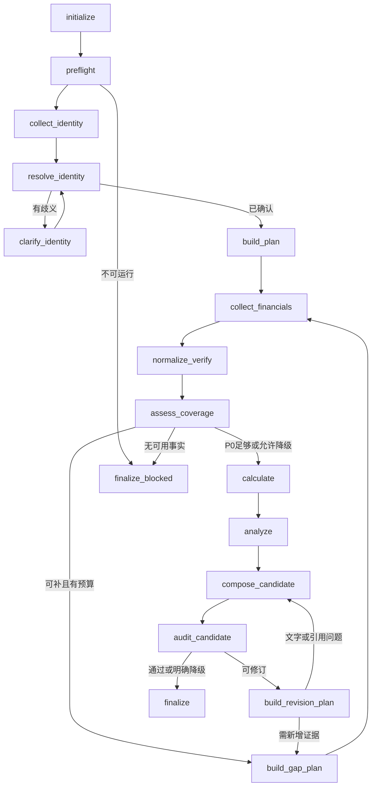
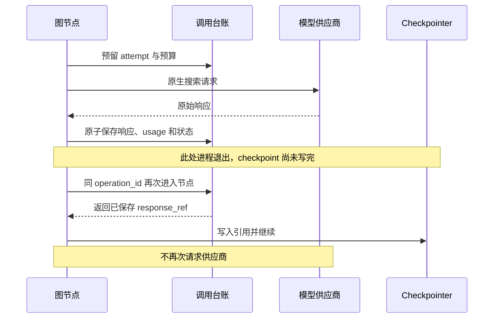

# AI 公司研究内核：P0 详细设计

> 版本：v0.2 · 日期：2026-09-15 · 状态：设计稿，未实现、未执行验证  
> 配套文档：[总体架构与技术选型 v0.1](AI公司研究内核_技术架构与选型_v0.1.md)  
> 本稿目标：把总体架构细化成可编码的节点、数据契约、原生搜索协议和恢复时序。  
> 范围仍然仅限 AI 分析内核，不设计前端、HTTP 服务、部署或交易执行。

---

## 0. 本稿解决什么

总体稿回答“选什么、怎样分层”；本稿回答：

1. 第一条能恢复的研究链具体有哪些节点？
2. 每个节点读什么、写什么、什么情况下跳转？
3. 模型原生搜索返回 HTTP 200、工具失败、暂停、无结果时分别怎么办？
4. 请求发出后崩溃，如何避免盲目重发和重复扣预算？
5. 搜索、证据、财务指标、计算和报告如何串成可核验的链？
6. 怎样区分失败续跑、人工回答、服务端续接、已结束草稿补跑？
7. 后续编码从哪些核心文件开始，不先造一个通用平台？

### 0.1 已确认与尚属建议

**用户已确认：**当前仓库独立 Python 模块；A 股与港股优先；LangGraph + LangChain；优先模型原生 WebSearch；本轮继续写文档、不改业务代码。

**本稿建议、尚不是已实现事实：**P0 使用 `standard_p0` 简版剖面，先打通一家公司的一条闭环；默认不输出具体买卖价格；采用下文的存储、预算和错误协议。模型账号、精确版本、费用上限和双源准出政策仍需实施前确认。

### 0.2 关于与总体稿的关系

- 三种完整业务模式、上游规则和来源清单仍以总体稿为基线。
- 本稿的 `standard_p0` 是**实施阶段子集**，不是把“近五年、近四季度、DCF、四角色”等需求删除。
- 原生搜索、操作台账、已结束 partial 补跑、报告审计哈希等细节，以本稿较明确的契约为准。
- 文中标为“项目契约”的字段、类名、节点名，不是 LangGraph 或模型 API 的内置参数。

---

## 1. P0 范围：有边界地证明闭环

### 1.1 输入与输出

输入：一家上市公司、可选证券/市场提示、研究截止时间、已批准预算与运行策略。

输出：

- 公司与证券身份及出处。
- 最新已披露完整财年及上一可比财年的少量核心财务指标。
- 一句话商业模式、主要证据和不确定性。
- 可由已有输入可靠计算的同比、利润率、现金流代理指标。
- 可选的价格/股本/估值快照；取不到则明确缺失，不阻断其余事实报告。
- 简版研究报告、引用清单、计算记录、审计结果、运行状态与缺口。

**P0 不是完整投资决策报告。** 五年趋势、完整近期季度覆盖、反向 DCF、三情景定价与多角色会审在 P1/P2 逐步接入。

### 1.2 完成状态不能偷换范围

```text
mode = standard
profile = standard_p0
result_quality = complete | partial | blocked     # 相对于 P0 已声明范围
full_mode_coverage = partial                       # 尚未满足完整标准研究
investment_decision = not_assessable              # P0 不给具体操作判断
```

报告标题必须包含“简版 / P0”，并列出未覆盖的完整需求。不能展示一个裸 `complete`，让读者误以为三种能力或完整公司研究已经实现。

### 1.3 P0 暂不建设

- 任意图编辑器、动态 YAML 工作流执行器。
- 多租户调度、Web 服务、消息队列、分布式 Agent。
- 第一版就部署向量数据库、知识图谱或自动学习系统。
- 让模型编写和执行金融计算代码。
- 无边界联网、付费墙绕过、后台自动更换收费供应商。

---

## 2. 最小架构与职责

```text
调用方 / 本地入口
      │ ResearchRequest
      ▼
ResearchRunner
  ├─ 冻结 RunManifest / 初始输入
  ├─ 防重复开始 / 同 run 单次推进
  └─ 调用 LangGraph
      │
      ▼
固定 P0 图
  ├─ collect_evidence 子图（身份/财务/补检索共用）
  ├─ 归一与验证节点
  ├─ LangChain 结构化分析节点
  └─ 确定性计算、报告审计与交付节点
      │
      ├─ NativeSearchAdapter      一次供应商交换
      ├─ DocumentReader           公开原文读取与解析
      ├─ ResearchRepository       证据、观测、产物
      ├─ OperationLedger          原始响应、尝试、预算
      └─ AsyncPostgresSaver       图状态、任务和中断
```

原生搜索能力由供应商服务端执行。LangChain 负责尽可能完整地接入模型接口，但不要求所有供应商必须经同一个兼容协议。必要时适配器内部直接用供应商 SDK，不能为了“统一”丢弃引用和续接信息。

### 2.1 P0 核心文件建议

```text
research-agent/
  pyproject.toml
  src/research_agent/
    contracts.py          请求、响应、证据、指标、错误等边界模型
    state.py              主图与取证子图状态
    runner.py             start / inspect / continue / resume / revise
    graph.py              固定 P0 图与路由
    collection.py         原生搜索—读取—抽取子图
    native_search.py       接口 + 首个供应商适配
    model_factory.py      LangChain 模型配置
    documents.py          公开文档获取与定位
    repository.py         证据、指标、不可变产物
    operations.py         请求台账、预算、错误与重发准入
    calculations.py       命名计算函数
    reporting.py          报告、引用、审计、交付清单
    settings.py           配置与密钥引用
    skill_loader.py       注册、校验、冻结规则版本
  skills/
    investment-research/SKILL.md
    investment-research/manifest.yaml
    shared/source-policy.yaml
    shared/metric-policy.yaml
    shared/report-policy.yaml
```

先按职责创建确实用到的文件。后续规模增长再拆 `nodes/graphs/adapters/repositories`，不先创建几十个空壳。

### 2.2 复用本地代码的具体方式

| 已有文件 | 可复用设计 | 必须改变 |
|---|---|---|
| `support-agent/.../persistence/checkpointer.py` | saver 生命周期、`await setup()` | 初始化迁移与单次研究分离 |
| `support-agent/.../services/runner.py` | 查询、同 thread 续跑、人工 resume | 工单类型换成研究类型，增加版本/结束状态检查 |
| `advanced-coding-agent/.../planning/langchain_planner.py` | Pydantic 结构化结果 + 领域二次校验 | 不复制 coding 任务 schema；不强制所有模型都用同一 structured-output method |
| `demo/deepseek_websearch.py` | 原生请求构造、搜索块识别 | 封装异步调用、原始响应保留、工具错误、引用和续接；不是复制后就算完成 |

不读取现有项目的密钥文件，不在新模块中依赖 `agent-mini/.env`。密钥通过研究模块配置注入，RunManifest 只保存非敏感配置和密钥引用名。

---

## 3. 主图：从固定阶段开始

### 3.1 图结构



图中省略的异常边界：未知程序异常、持久化错误向外抛出停图；不是每种异常都转去 `finalize_blocked`。需要运行期间新增授权时，使用独立的 `await_authorization` 中断节点。

### 3.2 节点输入输出表

| 节点 | 读取 | 写入（均为项目状态/产物） | 禁止事项 |
|---|---|---|---|
| `initialize` | 冻结的 request/manifest | 版本绑定、初始引用 | 重跑时重置 as_of 或生成新 run_id |
| `preflight` | adapter 能力、批准预算、策略 | CapabilityCheck、可运行/阻断理由 | 未授权即付费探测 |
| `collect_identity` | 原始公司查询、市场提示 | 候选公司/证券及证据 | 强制要求尚未解析出的 company_id |
| `resolve_identity` | 候选与公开身份信息 | CompanyIdentity / ClarificationRequest | 根据名称猜测上市主体 |
| `clarify_identity` | 固定问题版本和候选项 | 人工选择引用 | 在 interrupt 前发网络请求 |
| `build_plan` | 身份、as_of、P0 Skill、剩余预算 | 固定 question 集合、批次分配 | LLM 任意新增不相关研究目标 |
| `collect_financials` | 本轮取证计划 | 原文/证据/MetricObservation 引用集 | 把模型总结直接标为 VerifiedMetric |
| `normalize_verify` | observations、来源/指标策略 | MetricSnapshot、验证结果、冲突 | 不同口径求平均 |
| `assess_coverage` | 覆盖矩阵、验证状态、预算 | sufficient / gap / partial / blocked | 把文章长度当完成度 |
| `build_gap_plan` | 有限缺口列表 | 新 round 的确定性 task IDs | 无增量时无限重搜 |
| `calculate` | 已核验输入与公式策略 | CalculationRecords、不适用项 | 接受模型生成表达式并 eval |
| `analyze` | 证据包、计算、局限 | 结构化 claims / section | 生成新的裸数字或无来源事实 |
| `compose_candidate` | section、指标、引用 | 不可变候选报告及 hash | 原地覆盖已审计报告 |
| `audit_candidate` | 报告 hash、依赖、规则 | AuditReceipt | 修改其正在审计的报告 |
| `build_revision_plan` | failed check IDs、原观测与证据引用 | correction_plan_ref、受限修订目标、新 revision | 偷改 as_of 或预算 |
| `finalize` | candidate、有效 receipt、局限 | DeliveryManifest、结果引用 | 通过修改正文嵌入审计结果制造 hash 循环 |

### 3.3 哪些是模型节点，哪些不是

- 模型适合：有边界的查询改写、原文结构化抽取、商业模式归纳、证据语义支持审阅。
- 确定性代码负责：身份字段检查、日期/单位归一、数值验算、预算、ID、路由、引用存在性、产物 hash、状态判断。
- 人工负责：上市主体歧义、超预算授权、重大口径争议与明确的用途决策。

路由读取结构化枚举，不从模型自然语言里搜索“通过/失败”两个词。

---

## 4. collect_evidence 子图：原生搜索的可恢复边界

### 4.1 子图循环

```text
select_batch
  → prepare_exchange
  → call_native
  → normalize_native
      ├─ paused       → persist_continuation → prepare_exchange
      ├─ retryable    → retry_decision       → prepare_exchange
      ├─ empty        → update_gap           → select_batch
      ├─ usable       → select_documents → fetch_one → extract_one → ...
      ├─ unknown      → await_authorization / stop
      └─ unavailable  → record_gap / stop
  → merge_evidence_refs
  → select_batch / END
```

同一份取证子图用于身份查询、财务数据和补检索，`purpose` 控制所需 schema 与来源策略。

P0 先按文档逐个 `fetch_one/extract_one`；性能确有需要再改有限并发。这样中途失败时可以从单份文档附近恢复，而不是重做几十份下载。

### 4.2 每次请求之前固定身份

```text
batch_id       一个逻辑问题组
call_seq       batch 内的一次供应商交换序号（包括续接/语义重试）
operation_id   hash(run_id, task_id, batch_id, call_seq, payload_hash, adapter_version)
attempt_id     同一 operation 的实际传输尝试标识
```

- `prepare_exchange` 生成 ExchangeSpec 并返回 state，形成 checkpoint 边界。
- `call_native` 读取已经冻结的 ExchangeSpec，不自己递增 call_seq。
- 单纯节点重跑仍是原 operation_id；能复用响应则不发新请求。
- 工具返回明确失败、需要改查询或服务端续接时，路由生成新的 call_seq。
- payload 改了就不是同一个操作，不能继续复用旧 operation_id。

### 4.3 关键区别：传输成功与研究成功

```text
HTTP_RESPONSE_STORED
  只说明收到并保存了一次响应

SEARCH_EXECUTION_OBSERVED
  说明看到真实搜索执行记录

EVIDENCE_USABLE
  说明该响应产生可读来源、且满足当前取证要求
```

三者不能合成一个 `success=True`。

HTTP 200 内有工具错误时，仍保存原始响应。重跑 `call_native` 可以复用它，但 `normalize_native` 会再次判定错误；要重新发请求必须经过 retry_decision 创建新交换，不能不断读取同一错误缓存并称为“已经重试”。

---

## 5. 状态契约与运行状态

### 5.1 RequestContract

| 字段 | P0 约束 |
|---|---|
| `request_id` | 非空；同 ID、不同请求内容拒绝覆盖 |
| `company_query` | 保留用户原文，不当成已确认公司 |
| `market_hint` | 可空；CN_A / HK |
| `security_hint` | 可空；代码/交易所/股份类别 |
| `mode/profile` | standard / standard_p0 |
| `as_of` | 明确时区；缺失时由可信运行时钟固定一次 |
| `budget_policy_ref` | 运行前已批准的配置引用 |
| `authorization_ref` | 允许的供应商、数据访问及费用策略 |
| `parent_run_id` | 修订 run 时使用，可空 |

请求去重先比较用户提交的规范化输入，再生成缺省值；同 request_id 的重复请求必须复用首次冻结的 as_of，不因第二次调用时钟不同而被误判为新请求。

`as_of` 在**第一次身份联网之前**冻结。历史时点研究不仅财报要符合时间限制，公司名称、证券上市状态与管理层任期也要有相应历史有效时间。

### 5.2 主图状态最小字段

```python
class P0ResearchState(TypedDict, total=False):
    run_id: str
    request_ref: str
    manifest_ref: str
    identity_ref: str
    clarification_ref: str
    plan_ref: str
    collection_ref: str
    metric_snapshot_ref: str
    calculation_set_ref: str
    analysis_ref: str
    coverage_ref: str
    gap_round: int
    report_revision: int
    candidate_ref: str
    audit_ref: str
    delivery_ref: str
    last_domain_outcome: str
```

这是字段示意，后续可由 Literal/枚举约束状态值。客户端、连接、API Key、完整 PDF、整个供应商响应不放 state。

### 5.3 取证子图状态

```text
purpose / task_id / plan_ref / batch_cursor
batch_ref / call_seq / exchange_ref / response_ref
normalized_result_ref / continuation_ref
document_queue_ref / document_cursor
new_evidence_refs / new_observation_refs
gap_refs / retry_count / completed
```

P0 顺序循环中可用有界引用集合；引入并行时改为 task_id 键控 reducer。不能用一个共享的 `messages` 让多个角色互相覆盖。

### 5.4 三种“状态”分别归谁负责

| 状态 | 权威来源 | 示例 |
|---|---|---|
| 图执行状态 | checkpoint 的任务、中断、next 与状态值 | 待运行、暂停、节点失败、结束 |
| 外部请求状态 | OperationLedger | 已预留、发出、响应已存、未知 |
| 研究质量与报告状态 | Coverage、AuditReceipt、DeliveryManifest | 证据不足、P0完整、草稿、不可准出 |

state 中的 `phase` 或 `last_domain_outcome` 只作领域标记，不是唯一执行真相。

`next=()` 也不能单独证明成功：还要检查任务错误、中断、delivery_ref 及其绑定的报告和审计是否有效。

### 5.5 运行状态转换

```text
created → running
running → interrupted → running
running → failed_retryable → running
running → failed_terminal
running → completed（result_quality=complete/partial/blocked）
running → cancelled
```

`interrupted` 仅指等待外部输入；供应商 `pause_turn` 是内部协议续接，若能自动继续则 run 仍为 running，不显示成“等待用户”。

`failed_retryable` 是 Runner 综合异常和 checkpoint 计算出来的外部运行视图；不能假设抛异常的节点还能成功把 failed 写进自己的 checkpoint。

---

## 6. 原生搜索适配器详细协议

### 6.1 接口

```text
execute(spec: NativeExchangeSpec) -> RawProviderResponse
normalize(raw_ref, spec) -> NativeStepResult
```

`execute` 只执行一轮供应商交换；不隐藏一个无限 while 搜索循环。

`normalize` 必须可重复执行、没有网络副作用，以便在响应已经落盘后修复解析器或恢复下一阶段。

### 6.2 NativeExchangeSpec

```text
provider / endpoint_id / model / tool_version / adapter_version
purpose / batch_id / call_seq / operation_id
request_payload_ref / request_payload_hash
expected_capabilities / timeout_policy_ref
continuation_ref / budget_reservation_policy_ref
```

endpoint_id 对应允许的配置，不接受网页给出的任意模型请求地址。保存真实模型返回标识，识别兼容服务对传入模型名的映射；不能只保存请求时写的名称。

### 6.3 NativeStepResult

| 字段 | 语义 |
|---|---|
| `transport_status` | responded / failed_before_send / outcome_unknown |
| `search_status` | observed / not_observed / unknown |
| `step_status` | usable / empty / paused / tool_error / invalid / unavailable |
| `provider_request_id` | 可空，不虚构 |
| `search_events` | 实际可观察 query/action/tool ID；未暴露则标 unknown |
| `source_candidates` | 实际响应中的 URL/title/片段/时间提示 |
| `provider_citations` | 供应商原始引用及定位，不视为自动已核验 |
| `continuation_ref` | 只能由对应供应商适配器消费的 opaque 引用 |
| `tool_errors` | 结构化 code、retry_class、来源块 |
| `usage` | 已知 tokens、工具次数、费用及 unknown 字段 |
| `raw_response_ref` | 完整协议证据，不是仅 answer.text |

未知值统一为 null/unknown，不能为了让 schema 通过填零。

### 6.4 首个候选：DeepSeek

已有本地 demo 采用 Anthropic 兼容 Messages 端点，声明 `web_search_20250305`，读取 `server_tool_use` 和 `web_search_tool_result`。这些是候选实现起点，不是本次已验证的能力矩阵。

验收前不得默认：

- 所有 Anthropic 原生工具版本都可用于兼容服务。
- `allowed_domains`、`max_uses`、全部 citation 字段的语义完全相同。
- `tool_choice` 一旦配置就一定发生搜索。
- `page_age` 是财报公开日期。
- LangChain 标准化内容保留了全部供应商原始字段。

实施时优先核验四件事：真实执行事件、可读取来源、错误块语义、续接所需内容。无需先更换模型，只需为具体端点建立经过验证的能力档案。

### 6.5 预检避免重复浪费

- 静态预检：配置/工具类型/允许模型/预算策略，无付费调用。
- 实际预检：优先与首个身份搜索合并，验证一次真实调用，而不是每个节点都做一次额外探测。
- 缓存能力档案按 provider/endpoint/model/tool_version/adapter_version 绑定；更换其中任何一项需重新确认。
- 每次研究仍检查真实搜索事件，不能因为上次预检成功就忽视本次工具被禁用。

### 6.6 搜索服务端续接

当原生协议表明 paused：

1. 保存完整原始内容及 opaque 续接引用。
2. 当前交换结束并产生 checkpoint。
3. 检查 continuation_count、预算、运行期限。
4. 生成 call_seq+1，使用该供应商要求的原样上下文续接。
5. 若 adapter 不支持续接或字段缺失，标记能力不足，不把已有片段当成完整报告。

不要把 Anthropic 的 opaque 内容交给 OpenAI/DeepSeek 等其他供应商，也不能只保留纯文本后尝试继续。

### 6.7 搜索引用与自建引用链

供应商引用提供“模型引用了哪里”的线索。应用还要把它转为：

`DocumentSnapshot → Evidence → Metric/Claim → ReportCitation`。

若供应商引用字段不可得但能观察到真实搜索和来源 URL，可通过原文读取构建应用引用链；这属于明确的能力替代方案，需要调整并批准 profile 的 capability policy，不能在加载要求 `inspect_citations` 的 Skill 时静默跳过。

只得到模型编造式超链接、没有真实执行记录时，这个替代方案也不成立。

---

## 7. 搜索任务与来源契约

### 7.1 ResearchQuestion 最小字段

```text
question_id / topic / purpose / required
company_ref（身份确认前可空）/ raw_company_query
security_ref / period_spec / evidence_type
source_policy_ref / query_variants / coverage_status
```

身份阶段与公司分析阶段共享基础协议，但输入约束不同。不能形成“要先知道 company_id 才能搜索，而 company_id 又必须靠搜索得到”的循环依赖。

### 7.2 P0 问题表

| question_id | 目的 | 来源偏好 | 完成条件 |
|---|---|---|---|
| identity | 确认企业与证券 | 官方披露/交易所/公司 IR | 主体、市场、代码、股类有证据 |
| latest_filing | 找最新已公开完整财年 | 原始年报/更正公告 | 文档公开时间≤as_of，期间明确 |
| core_financials | 两个可比年度的核心报表 | 原始财报 + 复核渠道 | 指标、单位、币种、合并口径齐全 |
| business | 公司怎么赚钱 | 年报业务部分、公司 IR | 一句话定义与收入来源有证据 |
| challenge | 最关键的不确定性/反证 | 正式风险披露、具名外部材料 | 有反证或明确未找到的记录 |
| quote_optional | 可选证券估值快照 | 可用报价来源 | 时间、价格、股本、币种匹配，否则缺失 |

完整五年数据、四季度覆盖和深估值不作为 P0 已满足项。

### 7.3 参考地址如何进入代码

来源注册表保存域名/用途/可信类型/访问限制，不保存“某公司永远在某 URL”的猜测。

- A 股：`cninfo.com.cn`、适配范围内的交易所官方站点、公司 IR；`eastmoney.com` 作补充复核。
- 港股：中国香港披露易 `hkexnews.hk`、公司 IR；`aastocks.com` 作补充复核。
- 未配置交易所/证券类型时返回明确缺口；A 股范围不能隐式等同沪深全部已实现。
- 同一发行人官方报告的镜像按一份原始来源处理。

完整地址和上游原始规范见总体稿第 10、20 节。来源页面只作为资料，不赋予网页正文指令权限。

### 7.4 DocumentSnapshot / Evidence

```text
DocumentSnapshot:
  snapshot_id, requested_url, final_url, canonical_url
  publisher_id, origin_group_id, content_hash
  publication_time, retrieval_time, mime_type
  content_ref, parser_version, access_status

Evidence:
  evidence_id, snapshot_id
  locator（页码/表格/段落及可用坐标）
  quote, surrounding_context_ref
  supported_question_ids, source_tier
  independence_status, temporal_status
```

- PDF 页面定位要固定采用文件页序还是印刷页码，必要时两者同时保存。
- 来源定位与内容哈希绑定，不能更新正文但保留旧页码引用。
- 只有搜索摘要时 `access_status=snippet_only`，不声称已经读取年报全文。
- `publication_time` 不明时不能自动满足严格历史 as_of 要求。
- 更正公告不覆盖原观测，形成新版本；判断使用哪个版本取决于 as_of。

---

## 8. 指标、计算与证据准入

### 8.1 MetricObservation

```text
observation_id, company_id, security_id（适用时）
metric_code, value_decimal_string, unit_scale, currency
period_start, period_end, period_type
accounting_standard, consolidation_scope, adjustment_basis
evidence_ids, publication_time, extraction_version
```

自然年与财年标签不能代替实际期间。缺失值不是零；单位“亿元”归一后还要保存原始显示文本供审核。

### 8.2 验证状态拆开

```text
source_verification:
  primary_verified / secondary_only / unavailable

cross_check:
  independent_confirmed / shared_origin_checked / conflict / missing

usability:
  usable / usable_with_limitations / blocked
```

不要压成一个布尔 `verified`。例如：原始年报数字可准确抽出，但双源要求尚未完成，这是两个不同结论。

### 8.3 P0 默认准出政策

延续总体稿严格默认值：关键事实缺少要求的独立复核时，可以作为“单一权威披露已核实”的事实展示，但结果标为 partial，不能掩盖双源缺口。

采用“原始披露 + 独立抽取交叉检查”作为充分财务验证是一种可能更实用的替代政策，但需单独确认版本，不自动把它说成两次独立事实观察。

### 8.4 P0 命名计算函数

| 函数 | 必需输入 | 不适用/注意 |
|---|---|---|
| `revenue_yoy` | 同口径连续可比期间收入 | 基期为零返回 undefined，不补 0% |
| `net_margin` | 同期间、同范围净利润与收入 | 指明使用归母还是合并净利润 |
| `fcf_proxy` | 经营现金流、明确定义的资本开支现金流 | 名称注明 proxy，不冒充完整 FCFF/FCFE |
| `quote_market_cap` | 同证券类别价格与股数 | A/H 多股类分别定义；不盲乘所有股本 |
| `pe_snapshot` | 同币种、匹配股类及拆股口径的价格/EPS | EPS≤0 标不适用，时间不匹配阻断 |

输入从 MetricSnapshot 读取，不从报告文字重新提取。模型可以建议使用哪种指标，但不能绕过函数输入契约。

### 8.5 CalculationRecord

```text
calculation_id / formula_id / formula_version
input_observation_ids / input_snapshot_hash
parameters / applicability_status
result_decimal_string / unit / display_precision
warnings / output_hash
```

结果与输入快照绑定。补入新财报、改变资本开支定义或替换价格后，旧计算不再被新报告直接引用。

---

## 9. 持久化与操作台账：本地事务边界

### 9.1 不要把 checkpoint 当完整数据库

建议分三组逻辑对象：

1. LangGraph 自身的 checkpoint 表，由相应 saver 管理，不直接操作内部表结构。
2. 应用记录：run manifest、operation/attempt、预算、响应、证据、指标、报告 manifest。
3. 大文档内容：不可变文件或内容存储，应用记录只保存 hash 与引用。

这只是内核持久化契约，不涉及数据库部署、Web 服务或队列。

### 9.2 P0 对原生响应的明确选择

**优先把供应商协议响应作为有大小上限的应用数据库产物，与 attempt 完成和预算结算在同一个本地事务登记。** 这样 checkpoint 即使没写成功，恢复也能根据 operation_id 找回响应。

- 不把原始响应塞进 checkpoint。
- 配置单响应体大小上限；超限不截断续接内容后假装完整。
- 原始响应若含需要保留的 opaque 内容，按受控数据保存；不写认证头或普通日志。
- 大规模响应转对象存储属于后续扩展；届时必须补“先写 blob、再登记引用”的崩溃窗口处理，不能只换一个路径字段。

### 9.3 Operation 与 Attempt

| 对象 | 唯一键 | 状态 |
|---|---|---|
| `Operation` | operation_id | prepared / response_stored / abandoned / unresolved |
| `Attempt` | attempt_id，关联 operation | reserved / in_flight / responded / failed_before_send / unknown |
| `BudgetReservation` | attempt_id + budget_kind | held / settled / released / held_unknown |
| `RawResponse` | attempt_id | 不可变协议数据及 hash |

收到错误 HTTP 响应也是 responded，具体语义由 normalize 判断。它不等于 operation 的研究目标成功。

### 9.4 执行顺序

```text
1. 根据 operation_id 查现有记录
2. 有已存响应 → 返回 response_ref，不发请求
3. 有 in_flight / unknown → 进入对账/授权分支，不盲重发
4. 没有记录 → 原子创建 attempt 并预留预算
5. 把 attempt 标为 in_flight，再发请求
6. 收到响应
7. 一个本地事务中：保存原始响应 + 标 responded + 结算已知 usage
8. 节点返回 response_ref
9. LangGraph 保存 checkpoint
```

第 7 步与第 9 步不是同一事务；这是刻意允许的。若第 7 步完成、第 9 步失败，节点重跑能从 ledger 复用响应。

### 9.5 无法消除的未知窗口

“供应商已经处理请求，但客户端未收到/未保存响应”时：

- 按 unknown 记录，不把预留立即释放。
- 能查询供应商请求结果时做对账；没有查询能力就保持未知。
- 只有事先授权了这种重发成本策略或获得人工确认，才新建交换重发。
- 不声称 checkpoint、重试装饰器或 request_id 可以让外部付费请求恰好执行一次。

先标 in_flight 再发送也有“已标发送、其实还没发就崩溃”的小窗口。仍然保守视为 unknown，不能仅凭本地标志确定供应商是否消费。

### 9.6 首次启动的崩溃边界

Runner 在调用图之前，先持久化请求、manifest 和初始输入引用。

- run 已登记但还没有初始 checkpoint：恢复应读取同一冻结输入，初始化图。
- 已存在未完成 checkpoint：使用继续接口，而不是再次提交初始输入。
- 已有有效 delivery：返回交付结果，不重跑整个图。

这避免“request_id 已存在就以为运行完成”或“无 checkpoint 就重新生成 as_of”的错误。

---

## 10. Checkpoint 与四种不同恢复

### 10.1 默认选择

- 持久化：`AsyncPostgresSaver`。
- durability：`sync`，优先降低已完成阶段丢失概率。
- thread：一个 run 一个 thread，不按公司名共享。
- 子图：默认 per-invocation 继承父 checkpointer，输入输出显式转换。
- `InMemorySaver` 只用于后续离线单测，不是重启恢复方案。

这些语义参考已核对的 LangGraph 官方文档，详见第 19 节；具体安装版本需实施时锁定。

### 10.2 故障续跑

前提：原图尚未结束，图/Skill/schema 与冻结 manifest 兼容。

```text
读取 checkpoint + ledger
  → 判断未完成任务及未知请求
  → 若无需人工确认，使用相同 thread 执行 ainvoke(None)
  → 已持久化结果复用，未完成节点继续
```

不是从 Python 中断行恢复；节点可能重跑，因此外部操作必须通过台账。

### 10.3 人工中断恢复

将问题生成与等待回答拆开：

```text
prepare_question（固定 question_id/version/options，保存）
  → await_answer（只调用 interrupt，校验 answer）
  → apply_answer
```

`HumanResponse` 至少包含：

`run_id, interruption_id, question_id, question_version, expected_checkpoint_id, answer, answer_id`。

- Runner 检查问题仍在等待，拒绝过期 checkpoint 的回答。
- 同一个 answer_id 重复提交应幂等；不同回答不能偷偷覆盖已经采纳的回答。
- 使用 `Command(resume=...)` 恢复，不通过改写 state 假装回答过了。
- `await_answer` 恢复会从节点开头重跑，因此此节点不做搜索、扣费或发送通知。
- GraphInterrupt 属于控制流，必须传播，不能转成“模型失败”。

### 10.4 供应商续接

它不是人工中断：根据已存 continuation_ref 创建下一次交换；正常情况下自动继续。LangGraph 只能在交换之间 checkpoint，不能接管供应商内部每次搜索。

### 10.5 已结束 partial 的补跑

已经捕获错误、生成草稿并 END 的图没有待完成节点；`ainvoke(None)` 不能使它自动补齐资料。

P0 明确采用：

```text
revise_run(parent_run_id, gap_selection)
  → 新 run/thread
  → 冻结继承策略与 as_of
  → 按依赖清单复用有效旧证据
  → 补指定缺口
  → 重算受影响指标/分析/报告
  → 新审计和新交付
```

如果用户想更新到新日期，应创建 refresh run，明确改变 as_of；不是把原 run 的截止时间悄悄改掉。

### 10.6 同 run 单推进

P0 先要求一个运行进程持有 run 级排他锁；第二次 continue/resume 必须拒绝或等待。

内存锁只能防同进程冲突。若允许两个 CLI 进程同时推进同一 run，需使用现有持久化连接可支持的跨进程锁或租约；否则明确限制使用方式，不能宣称线程内锁已经覆盖多进程。

---

## 11. 恢复时序图

### 11.1 响应已存、checkpoint 前崩溃



### 11.2 请求可能已消费，但响应未知

```text
in_flight → 连接断开 / 进程退出
  → 恢复检测到没有完整响应
  → attempt=unknown，预算=held_unknown
  → 查询供应商（若能力存在）
       ├─ 找回响应 → 保存、结算、继续
       └─ 查不到/不支持 → 预授权重发或人工确认
  → 未获授权则停止，保留已有结果和未知费用说明
```

### 11.3 暂停续接

```text
call_seq=0 → raw paused 响应落盘 → checkpoint
  → normalize → continuation_ref
  → prepare call_seq=1（新预算预留）→ checkpoint
  → 原样续接 → usable / paused / tool_error
```

call_seq 是应用协议序号，不等于供应商内部搜索次数。

---

## 12. 重试、错误和超时的精确定义

### 12.1 不叠加三层盲重试

P0 建议：关闭 SDK 未计账的自动重试，节点与业务层只保留一个明确的重发决策入口。

| 情形 | 可否原操作自动重试 | 下一步 |
|---|---|---|
| 确定请求未发出的连接准备错误 | 可限次重试，同 payload，新增 attempt | `RetryPolicy` 仅针对可信的前发送异常 |
| 已收到明确 429/5xx | 响应先保存；按供应商语义决策 | 新 call_seq，计入请求预算，遵守 Retry-After |
| HTTP 200 内工具临时错误 | 不把错误缓存当成功 | normalize 后受控创建新交换 |
| 请求发送后读超时/连接断开 | 不可盲重试 | unknown 对账/授权 |
| schema 解析失败 | 优先重跑纯解析；必要时一次模型修复 | 修复调用也要预算和台账 |
| 空搜索结果 | 不是传输失败 | 改写有限查询，记录缺口 |
| 401/403/工具未授权 | 不自动重发 | 配置阻断 |
| 程序 bug、数据库失败 | 不降级成搜索空 | 向外抛出，保留 checkpoint |

若 SDK 无法区分是否已发送，采用 unknown 的保守策略。不能仅凭异常名称包含 timeout 就认定安全重试。

### 12.2 超时层次

- 连接超时：建立连接的上限。
- 响应/读取超时：单次请求等待上限。
- 交换总时限：包含服务端搜索的这一次交换。
- run 活跃执行预算：防无限补检索/续接。
- 人工等待期限：与活跃执行预算分开，等待用户不消耗模型 token，但可能导致证据过期。

绝对运行期限、已消费活跃时间需要持久化；不能每次恢复都重新给满时长。

LangGraph 新版节点 `timeout=` 是单次尝试边界，不代替 run 总预算。取消 await 也不证明供应商停止消费。

### 12.3 错误对象

```text
error_id / category / code / message_safe
operation_id / attempt_id / node_id
retry_class / response_ref / cost_status
recoverability / recommended_action
```

不把密钥、全量响应或用户隐私塞进 `message_safe`。

---

## 13. 预算与授权

### 13.1 所有付费调用进入同一账本

包括：身份搜索、实际能力探测、正式研究、服务端续接、结构化抽取、报告生成、模型审稿、schema 修复和重发。

计算节点和本地解析不计模型费用，但仍计运行时长与资源限额。

### 13.2 预算不变式

```text
已结算费用 + 未结算预留（含 unknown） ≤ 已批准额度
```

这个不变式只有在可合理限制单次请求最大消费时才构成硬上限保证。

- 能硬控工具次数/最大 token 且计费完整：使用最坏情况预留。
- 原生内部搜索或总结费用无可验证上界：只能提供停止后续请求的软预算。
- 用户要求严格封顶，但供应商不具备所需控制：阻止该配置运行，不谎称台账可以解决。
- 未知费用不能填 0，也不能在下一次恢复时自动释放预算。

### 13.3 预算配置需要显式区分

```text
max_exchange_requests
max_observed_search_actions（只有可观察时有效）
max_documents
max_output_tokens_per_request
max_gap_rounds / max_revisions / max_continuations
max_active_duration
cost_limit / cost_limit_mode(hard|soft)
unknown_cost_replay_policy(block|preauthorized)
```

这些是项目配置，不一定能原样映射为供应商 API 参数。一个不存在内部次数控制能力的适配器不能接受硬搜索次数限制却忽略它。

---

## 14. 分析与报告生成

### 14.1 分析节点的上下文包

只提供：

- 已确认公司/证券身份和 as_of。
- 当前 P0 研究问题。
- 已核验指标及有限的证据短引。
- 程序计算结果及不适用项。
- 明确缺口、矛盾和来源限制。
- 当前阶段的 Skill 方法与输出 schema。

不提供无关旧报告作为默认事实，不把供应商完整搜索上下文和几十份原文全塞进去。

### 14.2 AnalysisSection 契约

```text
section_id / title
claims[]:
  claim_id
  kind: fact | derived | interpretation | gap
  text
  evidence_ids
  calculation_ids
  counter_evidence_ids
  confidence_level
  limitations
```

约束：fact 必须有 Evidence；derived 必须有 Calculation；interpretation 必须有推理依据与不确定性；gap 明确缺什么，不伪装成公司负面事实。

结构化输出只是第一道 schema 检查。之后再校验引用 ID 是否存在、数值是否吻合、语义是否被支持。

### 14.3 P0 简版报告模板

```text
1. 范围声明：standard_p0、as_of、完整模式尚未覆盖项
2. 公司与证券身份
3. 一句话商业模式
4. 已披露财务事实与可复算指标
5. 主要风险和反证
6. 当前可得结论与不能回答的问题
7. 数据缺口与推荐下一步
8. 来源、定位和计算附录
```

不输出“已完成买入研究”或“完整投资建议”。P0 的投资决策字段固定 not_assessable。

---

## 15. 报告审计与交付：避免哈希自引用

### 15.1 三种不可变产物

```text
CandidateReport
  report_revision / content_hash / dependencies

AuditReceipt
  target_report_hash / policy_version / checks / result

DeliveryManifest
  report_ref / report_hash / audit_ref / audit_hash
  result_quality / full_mode_coverage / gaps / created_at
```

**审计不修改候选报告；交付清单关联二者。**

如果先审计报告，再把“审计通过”正文写回同一报告，报告 hash 变了，原审计便不再指向最终版本。因此 P0 将审计状态保存在独立 receipt/manifest；报告正文只注明审计记录由配套产物提供。

如果日后必须把审计摘要印进报告，应另定义“受审正文/展示包装层”的哈希范围，不临时忽略文件变化。

### 15.2 审计检查

| check_id | 规则 | 执行者 |
|---|---|---|
| identity_match | 报告与全部核心指标指向同一主体/证券 | 程序 |
| temporal_fit | 发布/期间/行情与 as_of 策略匹配 | 程序 + 日期来源记录 |
| reference_exists | 每个引用 ID、文档和定位存在 | 程序 |
| number_consistency | 报告数值等于绑定指标或计算的显示结果 | 程序 |
| basis_consistency | 币种、单位、会计口径一致 | 程序 |
| evidence_support | 证据是否支持文字断言 | 有边界的模型审阅，可人工复核 |
| counter_evidence | 核心解释是否处理反证或声明局限 | 模型辅助 + 规则 |
| scope_honesty | 明确 P0 范围及未覆盖需求 | 程序 |
| release_policy | 双源缺口/冲突与 complete/partial 状态一致 | 程序 |

P0 数字很少，优先全量检查；总体稿 15% 抽检策略用于后续较大报告的非关键数值，不代替关键数值全量审核。

### 15.3 审计失败的修订路径

- 纯文字/引用定位问题：重做候选报告，report_revision+1。
- 指标错误：生成 correction_plan_ref，包含错误 check_id、受影响 observation IDs、对应 evidence IDs 和需纠正的解析/单位/选值规则；回到 normalize_verify，所有依赖的计算和文本失效。修订产生新观测或新快照版本，不让模型直接覆盖原始数字。
- 缺真实资料：若有预算且尚有新增机会，生成定向 gap plan。
- 无法补齐：保留失败项，交付 partial/blocked，不删除失败检查以获得“通过”。

修订目标按 check_id 固定，不能借修订无边界扩大研究主题。

### 15.4 finalize 的幂等性

`delivery_id = hash(run_id, report_hash, audit_hash, release_policy_version)`。

- 相同输入再次 finalize 返回同一 manifest。
- manifest 已登记、checkpoint 未写完时，恢复只补状态引用，不重审或改稿。
- 不能用文件名“最终报告.md”当唯一完成证据。

---

## 16. 依赖失效与修订复用

### 16.1 简单依赖链已经足够

```text
DocumentSnapshot
  → Evidence
    → MetricObservation
      → MetricSnapshot
        → Calculation
          → AnalysisSection
            → CandidateReport
              → AuditReceipt
                → DeliveryManifest
```

每个产物保存 input_refs/hash。第一版用显式依赖列表，不需要图数据库。

### 16.2 哪些变化使哪些产物失效

| 变化 | 最低失效范围 |
|---|---|
| 只改报告措辞 | 报告和审计 |
| 引用定位变化 | 对应断言与报告审计 |
| 替换财务数字/口径 | 指标快照、依赖计算、相关分析、报告与审计 |
| 证券类别变化 | 价格/股本/估值相关全部产物；公司财务按主体匹配重审 |
| as_of 改变 | 时间有效性全量重审；可复用文档内容，但不能复用“截至旧日已核验”判定 |
| Skill/准出政策变化 | 相关分析和审计；重大图/schema 变化新建 run |
| 仅模型换版本 | 新生成的分析记录真实模型；旧产物可以作为有版本的输入，不冒充新模型结果 |

这避免“补了新财报，但最终报告还引用旧估值”的混合版本问题。

---

## 17. Skill 在 P0 中的具体加载点

### 17.1 启动时一次冻结

```text
读取注册表
  → 解析 manifest（安全 YAML）
  → 校验 schema / workflow_id / 工具白名单
  → 校验所需能力与当前 provider profile
  → 读取指定阶段规则
  → 计算规则哈希
  → 写入 RunManifest
```

不允许运行时从网页自动安装方法包；不把上游 Claude Code 工具名当作本项目可调用 Python 函数。

### 17.2 每个阶段使用哪部分规则

| 阶段 | 规则 |
|---|---|
| build_plan | 研究维度、P0范围、所需期间与覆盖条件 |
| native_search | 查询规范、来源偏好、真实搜索必须可观察 |
| extract | 事实/观点区分、原文定位、单位/期间/口径 |
| normalize_verify | 共享指标与双源策略，不依赖角色人格 |
| analyze | 商业模式与反证方法、输出 schema |
| audit | 准出、引用、数值、范围诚实规则 |

“某大师视角”只作为方法表达，不需要虚拟人格常驻进程，也不能伪造其真实语录。

### 17.3 为团队模式预留，但不提前实现

取证子图输入提前包含 `role_id/task_id`；分析产物保留 role。P2 可实例化四个私有上下文并行调用，然后显式 join。

P0 不写团队消息总线、不做 Agent 相互自由对话。相互质询将来通过结构化 Conflict/ResearchGap 处理即可。

---

## 18. 编码顺序和静态验收清单

### 18.1 按依赖分五个实现包

1. **契约与冻结输入**：contracts、state、settings、SkillLoader、RunManifest。
2. **一次原生调用闭环**：adapter、原始响应、错误解析、OperationLedger、预算。
3. **真实证据与计算**：文档读取、定位、指标归一、命名计算函数。
4. **固定图与恢复接口**：主图、取证子图、checkpointer、continue/resume/revise。
5. **简版报告与准出**：candidate、receipt、manifest、结构化事件。

先让第 2 包能证明“真搜索、有来源、失败可解释”，再扩大报告内容。

### 18.2 后续验收案例（本轮未运行）

| 案例 | 预期 |
|---|---|
| 同 request_id 重复开始 | 同请求返回原 run；不同内容拒绝 |
| 首个 checkpoint 前退出 | 用冻结初始输入恢复，as_of 不变 |
| 仅生成“我已搜索”的文字 | 搜索未核实，不准 complete |
| HTTP 200 + 工具错误 | 正确分类，响应可缓存但不当成功证据 |
| paused 响应 | 保存 opaque、下一 call_seq 续接 |
| 已存响应后退出 | 节点复用原响应，不重复发出请求 |
| 请求已发送但响应未存 | unknown，保留预算，需对账或重发授权 |
| 预算不足以覆盖身份搜索 | 请求发出前阻止 |
| 供应商无费用硬上限控制 | 不接受 hard cost policy |
| 同一财报多个镜像 | 一份原始来源，不误报双源 |
| 港股缺季度披露 | 标 not_disclosed，不除以二补季报 |
| 旧日期研究遇到后发更正公告 | 不把未来更正倒灌为当时事实 |
| 指标单位/会计口径不同 | 不平均，产生 conflict |
| 前期收入为零、EPS负值 | undefined/not_applicable，不错误计算 |
| report 修改后复用旧 audit | hash 检查失败 |
| manifest 已存后退出 | 幂等返回，不重生成报告 |
| 同 answer_id 重复 resume | 幂等处理，无重复推进 |
| completed partial 再 continue | 返回已经结束；提示显式 revise，不偷偷补跑 |
| 两进程同时推进 | 锁拒绝或串行，不能双重扣预算 |
| 任意未知异常 | 停图保留状态，不伪装数据不足 |

### 18.3 Definition of Done

P0 的定义不是“能写出一份 Markdown”，而是同时满足：

- 搜索真实发生且来源可追踪。
- 关键数字有口径、有出处、能计算复核。
- 缺失与错误被清楚标注。
- 进程重启、协议续接、人工回答有不同且正确的路径。
- 报告与审计绑定同一个不可变版本。
- 不把简版结果宣称为完整投资研究。

---

## 19. 冻结依据与待确认事项

### 19.1 已沿用的来源

本稿未增加“已经运行成功”的新事实；技术语义沿用总体稿中已阅读的官方资料：

- LangGraph checkpointers：<https://docs.langchain.com/oss/python/langgraph/checkpointers>
- LangGraph interrupts：<https://docs.langchain.com/oss/python/langgraph/interrupts>
- LangGraph fault tolerance：<https://docs.langchain.com/oss/python/langgraph/fault-tolerance>
- LangGraph subgraphs：<https://docs.langchain.com/oss/python/langgraph/use-subgraphs>
- LangChain 结构化输出：<https://docs.langchain.com/oss/python/langchain/structured-output>
- LangChain ChatAnthropic：<https://docs.langchain.com/oss/python/integrations/chat/anthropic>
- DeepSeek 兼容 API：<https://api-docs.deepseek.com/zh-cn/guides/anthropic_api/>
- DeepSeek Web Search 说明：<https://api-docs.deepseek.com/zh-cn/quick_start/agent_integrations/claude_code>
- Anthropic 搜索协议：<https://platform.claude.com/docs/en/agents-and-tools/tool-use/web-search-tool>
- OpenAI 搜索协议：<https://developers.openai.com/api/docs/guides/tools-web-search>
- ai-berkshire 方法源固定提交：`43fbaed85af8b88ce233b263e7c76c8a953ae380`，具体源码链接见总体稿第 20 节。

官方滚动文档与供应商兼容实现可能不完全一致；编码时必须锁包版本并对实际端点验收。本稿未执行模型 API、数据库、图、测试或服务验证。

### 19.2 编码前只需优先确认四项

1. 首个供应商的实际 endpoint、模型标识及账号是否开放原生搜索。
2. 预算是硬上限还是软停止阈值，未知费用是否允许预授权重发。
3. 是否接受 `standard_p0` 简版作为第一阶段交付，而不是一开始覆盖完整五年/DCF。
4. 财务准出坚持独立双源，还是接受“权威原文 + 独立抽取复核”的明确替代策略。

以上未确认前可继续写契约与离线设计，但不应代替用户选择付费配置或悄悄放松研究准出标准。

---

## 核心结论

**LangGraph 管阶段和恢复；LangChain 管模型与结构化接口；Skill 管研究方法；证据仓库管事实出处；操作台账管外部调用；程序计算和审计管可信输出。**

P0 把这些边界做好，后续四角色团队只是复用取证/分析子图并增加会审，而不是推倒重建整套系统。
