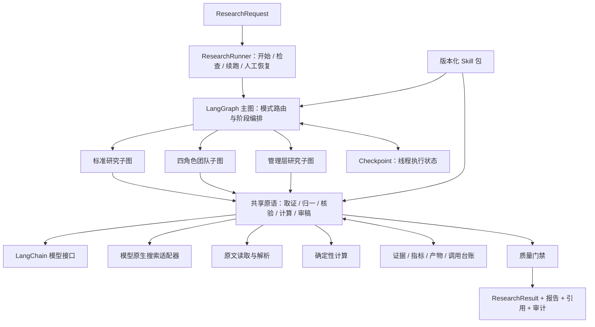

# AI 公司研究内核：技术架构与选型

> 版本：v0.1 · 设计日期：2026-09-15 · 状态：技术选型稿，待实现验证  
> 技术主线：Python + LangGraph + LangChain + 模型原生 WebSearch  
> 范围：AI 分析内核；不包含前端、HTTP 服务、任务队列部署、用户系统或交易执行。  
> 本文依据需求附件、本地源码与官方文档进行静态分析；未运行项目、测试、模型请求或数据库验证。文内代码是设计示例，不是已经实现并验证的交付代码。

---

## 0. 结论与已确认边界

### 0.1 推荐架构

**在当前仓库新增独立的 `research-agent/` Python 模块：用 LangGraph 编排确定性的研究阶段，用 LangChain 对接模型、结构化输出和受控工具；研究方法以版本化 Skill 包承载，联网走模型原生搜索适配器，证据与计算结果独立存储，checkpoint 只保存执行状态和引用。**

不要采用下面两种极端：

- 把整篇 ai-berkshire 提示词塞进一个无限循环 Agent，期待它自己保证恢复、财务口径和报告质量。
- 为每段分析创建独立服务，先建设一套通用 Agent 平台，再做第一份研究报告。

第一版是**模块化单体分析内核**，不是微服务，也不是任意 YAML 都能执行的工作流平台。

### 0.2 本轮已经确认

| 项目 | 决策 |
|---|---|
| 本轮交付 | 仅技术文档，不实现业务代码 |
| 代码落点 | 当前仓库中的独立 Python 模块 |
| 第一版市场 | A 股、港股，即境内及中国香港上市公司；美股留扩展接口 |
| 主框架 | LangGraph + LangChain |
| 搜索方向 | 优先模型内置 WebSearch，不把独立付费搜索 API 作为前提 |
| 业务模式 | 标准研究、四角色团队研究、管理层纵深研究 |
| 排除项 | 前端页面、Web 服务承建、部署方案、自动下单 |

### 0.3 最重要的五项工程决策

1. **图定义执行顺序，Skill 定义研究方法，确定性代码执行硬约束。** 不让提示词独自承担可靠性。
2. **搜索结果不是事实库。** 必须经过来源读取、实体/期间/币种归一、证据抽取与核验。
3. **团队模式是真并行、私有上下文、独立取证。** 不把一份主 Agent 总结分成四个角色复述。
4. **checkpoint 不等于“所有步骤恰好执行一次”。** 结合持久化、幂等产物、调用台账和明确恢复动作。
5. **信息不足时允许返回研究草稿或拒绝定价。** 不能为了满足“明确价格”模板而编造现金流、股价或股本。

---

## 1. 本地项目现状：复用哪些，不继承哪些

以下路径均相对当前工作区 `ai-agent-roadmap/`。行号来自本次静态阅读，后续代码变化可能导致偏移。

### 1.1 当前不是一个统一 Agent 平台

```text
advanced-coding-agent
  分类 → 规划 → 选步骤 → 执行 → 验证 → 完成门禁
                         ↑           └→ 重规划 / 阻塞

support-agent
  工单规范化 → 分类 → 检索/草稿/风险子图 → 人工中断 → 工具 → 完成
  已有 PostgreSQL checkpoint 与 thread 恢复入口

agent-mini
  手写模型/工具循环 + JSON 快照 + 代码 RAG + MCP 工具适配

 demo/deepseek_websearch.py
  原生搜索请求 → 识别服务端搜索块 → 日志与答案文本
```

### 1.2 静态审阅结论

| 模块/文件 | 当前实际能力 | 对研究内核的建议 |
|---|---|---|
| `support-agent/src/support_agent/persistence/checkpointer.py:9–19` | `AsyncPostgresSaver` 生命周期、`await setup()` | 优先复用这个模式，初始化迁移与单次运行分离 |
| `support-agent/src/support_agent/services/runner.py:16–96` | thread 配置、状态查询、`ainvoke(None)`、`Command(resume=...)` | 提取为研究内核的开始/检查/续跑/恢复接口，不继承工单领域对象 |
| `support-agent/src/support_agent/graphs/ticket.py` | 子图、风险/审批状态、真实 `interrupt` | 借鉴质量门禁和人工介入；当前静态语料检索不是联网研究 |
| `support-agent/src/support_agent/graphs/support.py:20–29` | `create_agent`、工具、结构化输出策略 | 可借鉴模型适配，但不要把整条研究链封进单个 `create_agent` |
| `advanced-coding-agent/src/advanced_coding_agent/planning/langchain_planner.py:59–116` | 结构化计划及领域校验 | 复用“结构化产物后再校验”的设计，不复用编码任务 schema |
| `advanced-coding-agent/src/advanced_coding_agent/planning/graph.py` | 规划、重规划、恢复策略、完成门禁；默认执行仍含演示行为 | 借鉴边界，不作为现成研究框架 |
| `advanced-coding-agent/src/advanced_coding_agent/multi_agent/execution.py` | 线程池、超时、按 task/attempt 聚合 | 借鉴任务身份与幂等思想；新模块用图级并行与子图 |
| `agent-mini/src/agent/checkpoint.py:172–204` | 原子 JSON 快照 | 不是 LangGraph checkpointer，不另建第二套恢复事实源 |
| `agent-mini/src/tools/registry.py:267–300` | 工具调用与异常包装 | 借鉴统一错误封装，需保留异常类型而不是一律转文本 |
| `agent-mini/src/rag/indexer.py`、`retriever.py` | Python AST 切块、哈希、代码检索 | 可借鉴内容哈希/定位；公司年报不适用 AST 切块 |
| `demo/deepseek_websearch.py:90–133,169–209` | 原生搜索、query/tool ID、URL/title/page_age 解析 | 是最直接的联网适配起点，但不是完整研究证据管线 |

### 1.3 必须明确的现存问题

**问题 A：advanced 中有节点方法同名遮蔽风险。**

`planning/graph.py` 同时包含：

```python
self.planner = planner                         # 第 249 行

def planner(self, state): ...                  # 第 300 行

builder.add_node("planner", runtime.planner)   # 第 1306 行
```

实例属性会遮蔽同名方法，注册的对象可能不是预期的节点函数。静态上应重命名为 `self.planner_service` 与 `plan_node()` 等；本轮没有运行确认，也没有修改该文件。这个问题进一步说明不应整体搬用 Coding Runtime。

**问题 B：搜索 demo 只完成“请求和观察”，尚未完成“研究取证”。**

- 已识别服务端工具块，但最终正文与引用没有形成统一证据对象。
- 没有抓取原文、来源谱系、财务期间/币种归一、断言级引用校验。
- 没有 checkpoint、调用预算台账、服务端工具错误分类与续接状态。
- 注释中的“强制搜索”需要由实际返回块确认，不能只看请求参数。

**问题 C：现有依赖声明不是兼容性证明。**

两个项目都声明 `langgraph>=1.0.0`、`langchain>=1.0.0`；support 额外声明 `langgraph-checkpoint-postgres>=3.1.2`。这些只说明允许安装的范围，不说明实际安装版本，也不保证具备当前文档中的所有新 API。

### 1.4 复用策略

新模块不直接 import 其他学习项目的内部包，不复制整套 `Runtime`。优先提取少量可理解的模式：

- support：持久化生命周期、thread 接口、interrupt 恢复流程。
- advanced：计划 schema、完成门禁、任务/尝试标识。
- mini：日志字段、工具错误分类、内容哈希思想。
- demo：DeepSeek 原生搜索请求和响应块识别。

只有出现第二个真实使用者时，再考虑抽出 `agent_core` 公共包。

---

## 2. ai-berkshire 的真实形态与迁移基线

### 2.1 上游版本

- 仓库：<https://github.com/xbtlin/ai-berkshire>
- 本次读取的默认分支：`main`
- 固定提交：`43fbaed85af8b88ce233b263e7c76c8a953ae380`
- 提交时间：2026-09-11 21:10:16 UTC
- 许可证：MIT，Copyright (c) 2026 xbtlin；复制实质内容时保留版权与许可声明。

它主要是**Claude Code / Codex 的研究 Skill、报告与辅助计算脚本集合**，不是可直接部署的 LangGraph 分析服务。[U1–U8]

```text
skills/*.md                  规范源文件
codex-skills/*/SKILL.md       多数由规范源生成的兼容产物
codex-prompts/*.md           slash prompt 兼容层
tools/*.py                   财务计算、抽检等辅助工具
reports/                     研究产物，不是自动可信的事实数据库
CLAUDE.md / AGENTS.md         特定运行环境下的全局约定
```

**迁移时以 `skills/*.md` 为规范源，不把三套兼容文件重复导入。** 上游 `TeamCreate/Task/SendMessage/Bash` 是其宿主环境的执行机制，不是业务规则；新系统用 LangGraph 子图、结构化返回值和受控计算函数替代。

### 2.2 从三种 Skill 提取出的核心流程

| 能力 | 必须保留的研究步骤 | 新内核的产物 |
|---|---|---|
| `investment-research` | 可研究性 → 数据收集与验算 → 生意本质 → 护城河 → 逆向风险 → 管理层 → 行业 → 估值 → 决策 → 抽检 | 标准报告、指标账本、计算记录、断言与来源、缺口清单 |
| `investment-team` | 确认团队/预算 → 可研究性 → 搜索能力预检 → 四角色并行 → 汇合 → 分歧会审 → 综合报告 → 抽检 | 四份独立分析、争议记录、综合报告、四维评分和 Checklist |
| `management-deep-dive` | 关键人物识别 → 四路并行采集 → 战略/执行 → 承诺兑现 → 危机应对 → 资本配置 → 治理 → 侧面验证 → 接班风险 → 加权评分 | 人物关系、承诺账本、配置事件、治理证据与管理层报告 |

补充：标准模式可以并发下载资料，但由一个主分析上下文按阶段形成判断；团队模式是四个独立判断上下文。管理层模式上游也明确要求四路**数据采集**，不要误做成只能串行的专项问答。[U1–U3]

### 2.3 Skill 原始硬规则与落地方式

| 上游要求 | 工程化表达 |
|---|---|
| A/B/C 信息丰富度 | `ResearchabilityAssessment`；附覆盖统计和原因，不能直接等同投资质量 |
| 已验证事实/推算/缺失分开 | `Claim.kind` 与 `verification_status`，渲染时不同标签 |
| 关键数据两个独立来源 | 来源谱系与验证记录；两个 URL 不自动等于两个独立来源 |
| 超过 1% 的差异标记 | 在同期间、同币种、同口径比较后应用版本化容差规则 |
| 财务指标禁止模型心算 | 只允许命名计算函数，记录输入指标 ID、公式版本和结果 |
| 搜索失败禁止伪装联网 | 检查实际服务端搜索事件；失败不得生成“最新完整报告” |
| 四角色真正并行 | 四个子图节点，独立消息/计划/证据发现，显式 join |
| 看多和看空同时呈现 | 核心观点必须关联支持与反对证据或记录未找到反证 |
| 明确判断和价格区间 | 数据准入通过后输出；证据不足时结构化 `not_assessable` |
| 15% 抽检 | 全量关键事实核验 + 非关键数值的固定种子抽样；报告变更后重审 |
| 管理层评分 35/25/25/15 | 配置化权重：诚信、战略执行、资本配置、治理 |
| 诚信一票否决 | 证据充分的重大诚信问题触发 veto；匿名指控不直接触发 |

### 2.4 不能原样照搬的地方

1. **阈值冲突。** `financial-data.md:67–77` 使用来源 1 为基准、1%/5% 两档；`financial_rigor.py:180–217` 默认 `tolerance_pct=2.0`，用中位数并含浮点转换。来源间 1% 差异与“到中位数 1%”不是同一种检查。[U4,U5]
2. **零值和负值边界。** `verify_market_cap()` 的报告值为零时把偏差设为零；`cross_validate()` 对负中位数及零中位数的处理不适合作为通用质量门禁。需改为有符号数据安全的比较函数。
3. **ROE 只是近似。** 上游 `verify_valuation()` 用 EPS/BVPS 计算 ROE，不能替代“同期归母净利润 / 平均归母净资产”的明确会计口径。
4. **资料入口不是永久可用 API。** 上游的“无需注册/直接访问”不能保证免反爬、免许可或长期可用。
5. **港股不一定有可用 ADR。** “AASTOCKS + Macrotrends ADR”不是所有港股的通用双源策略；ADR 价格、币种、比例不能直接映射原股。
6. **主源优先级需要调整。** 本方案把原始公告/年报放第一层，第三方聚合站用于补充和交叉复核，不先认聚合值为真值。
7. **抽检不是自动联网审计。** `report_audit.py` 负责抽取、抽样和判决；其需要外部填充核验值。它不自动保证核验值真实，也不能代替全文事实校验。[U6]
8. **历史估值不能机械套前复权股价。** 历史 PE 必须使用同一时点、拆股口径匹配的价格与 EPS，并防止未来信息泄漏；含分红调整的复权价格不天然适合还原当时 PE。
9. **长期估值规则是特定策略，不是通用金融定律。** 上游 `terminal_value.py` 的 r/g 区间、`r-g>=5pct`、风险建模规则应保存在 `berkshire` 策略包；通用计算层只执行数学定义、适用性和输入校验。禁止直接迁入脚本中已有公司的硬编码样本数据。[U1,U7]
10. **报告文件落点不继承。** 上游 `~/...`、`reports/...`、全局目录规范存在不同写法；新内核统一以 `run_id/report_revision` 标识产物。
11. **不生成假引言。** “大师视角”只是方法标签；模拟点评必须标注模拟分析，不得伪装成真实人物说过的话。

---

## 3. 技术选型及取舍

| 层 | 推荐 | 原因 | 第一版不做 |
|---|---|---|---|
| 语言 | Python 3.12+，锁定一个实际验证的小版本 | 与现有项目一致，异步生态适合网络研究 | 混用多种 Python 环境 |
| 编排 | LangGraph `StateGraph` | 明确节点、分支、恢复、人工中断 | 无上限自由多 Agent 群聊 |
| 模型与工具 | LangChain 模型接口、Pydantic 结构化输出、受控工具 | 复用模型适配与 schema；不接管所有业务流程 | 依赖一个超级 `create_agent` |
| 搜索 | `NativeSearchAdapter`，优先 DeepSeek 候选实现 | 用户已选原生搜索，本地已有 demo | 强制购买 Tavily/Exa |
| 原文读取 | `DocumentFetcher` + HTML/PDF 抽取适配 | 引用可核验、能保留页码/表格定位 | 把 Fetch 误认为另一套搜索服务 |
| 状态 | TypedDict 图状态 + Pydantic 边界模型 | 图更新轻量，输入输出可严格校验 | 把所有中间全文塞进一个 messages |
| checkpoint | `AsyncPostgresSaver` | 本地已有使用模式，支持进程重启恢复 | 自制 JSON checkpoint 作为主存储 |
| 证据/产物 | Repository 接口；结构化记录 + 不可变文档快照 | 与图状态解耦，便于查证和复用 | 第一版必须上知识图谱 |
| 计算 | Decimal + 命名公式；数值求根独立函数 | 金额单位可控，DCF 结果可复算 | 执行模型生成的任意 Python/eval |
| 文档检索 | 先标题/页码/关键词；需要时加全文检索 | 第一版核心是联网发现和证据核验 | 为少量文档先部署向量数据库 |
| 日志 | 标准结构化事件/JSONL；可选 LangSmith | 开源本地执行不依赖 LangSmith SaaS | 记录密钥、完整私有提示词和思考内容 |

### 3.1 版本策略

- 用独立 `pyproject.toml` 和锁文件，记录 Python、LangGraph、LangChain、模型集成包与 checkpoint 包的确切版本。
- LangGraph 官方当前文档中的节点 `timeout=`、`error_handler=` 要求 **`langgraph>=1.2`**；现有项目只声明 `>=1.0.0`，不能直接套用。[L3]
- 若决定使用这些能力，选择经过验收的 1.2+ 补丁版本；本轮不凭空给出“已测试兼容”的版本组合。
- 若先沿用较早版本：网络层设置超时，节点中只捕获已知业务/供应商异常；不能假装低版本已支持新参数。
- 模型集成包、checkpoint 包单独版本化，不按同一主版本号猜兼容性。

### 3.2 LangChain 与供应商原始协议的关系

普通推理、结构化分析优先走 LangChain。原生搜索也优先通过集成包调用，但**前提是工具配置、原始响应块、引用和续接信息没有丢失**。

如果某个集成包尚未完整暴露原生搜索能力，允许在 `NativeSearchAdapter` 内使用供应商 SDK/HTTP。这不改变 LangGraph + LangChain 主架构，也比伪造一个“通用 WebSearch 参数”更可靠。

**不要只接一个 ChatOpenAI-compatible 端点，就认为所有原生服务端工具都可跨供应商使用。**

---

## 4. 目标分层架构



### 4.1 六条边界

- **Graph**：决定下一步和是否停止，不保存网络客户端对象。
- **Skill**：定义应该研究什么、如何问、合格输出是什么，不任意执行代码。
- **Agent**：在指定角色/阶段内推理，可以提出新查询；不能自行扩展运行预算。
- **Tool/Adapter**：执行搜索、读取、计算，返回结构化结果或明确异常。
- **Evidence Repository**：保存实际看到的来源内容及来源谱系，不保存无证据的“记忆事实”。
- **Quality Gate**：执行覆盖、引用、口径、计算、预算规则；LLM 可以辅助判断语义，但不能覆盖硬失败。

---

## 5. 三条工作流如何设计

### 5.1 共同前置流程

```text
normalize_request
  → load_approved_budget
  → resolve_company
  → capability_preflight
  → discover_seed_sources
  → assess_researchability
  → build_plan_and_budget
  → optional_confirmation
  → route_by_mode
```

- `load_approved_budget` 在任何可能付费的身份检索、能力预检和种子搜索之前加载已批准额度；后面的计划阶段只是分配剩余额度，不是到那时才开始计费控制。
- `resolve_company` 解析公司、上市主体、证券类别、交易所、代码、别名；同名和多地上市有歧义时 `interrupt`，不要猜。
- 初始检索只用于身份、披露覆盖和资料可得性评估，不能把主分析师的观点预灌给四个角色。
- `capability_preflight` 包括模型/API/工具配置检查，以及实施时的最小实际搜索验收；配置有效不等于实际已搜索。
- team 模式按上游保留团队与预算确认能力。无人值守运行需调用方显式提供预授权策略，否则暂停待确认。
- 可研究性 A/B/C 根据可得文档、期间覆盖、来源类型记录理由；不是模型随口打一个等级。

### 5.2 标准研究：阶段确定、局部可迭代


每个分析节点接收“已验证指标 + 对应证据片段 + Skill 规则”，产出结构化 `AnalysisSection`。需要补充信息时产出 `ResearchGap`，由受控补检索节点处理，而不是在一条模型请求内无限研究。

建议将一次外部搜索批次、一次原文提取、一次模型综合拆成不同节点。否则一个节点运行很久后失败，只能重做整段。

管理层评分不确定、疑点重要时返回 `recommended_followups=[management_deep_dive]`。除非请求授权，不自动升级为耗费更高的专项研究。

### 5.3 团队研究：四个私有子图 + 显式汇合

```text
                     ┌─ Business：生意与护城河 ──────┐
team_dispatch ───────├─ Financial：财务与估值 ────────┤
                     ├─ Industry：行业与竞争 ─────────┼─ join
                     └─ Risk：风险、管理层与治理 ────┘
                          ↓ 各自内部可检索/核验

join → reconcile_metrics → identify_conflicts
     → targeted_verification（必要时，最多限定轮数）
     → lead_synthesis → release_audit → finalize
```

**独立性规则：**

1. 四个角色各自持有 messages、查询计划、发现记录、论证和预算额度。
2. 可共享公司身份、统一 as_of、会计/汇率口径及不可变原始文档缓存；首轮不能共享他人已经写出的结论。
3. 即使共享同一财报快照，各角色必须记录自己的查询/读取/引用过程。共享缓存不是新增独立来源。
4. 四角色可以使用同一模型；“四 Agent”是执行与上下文独立，不代表四个统计独立专家，也不自动消除模型共同偏差。
5. 财务角色形成初步估值；行业假设在会审中被修正时，由确定性估值节点重新计算，不能只改最后的文字。

固定四个父层节点，各节点封装一整个角色子图。父图汇合使用：

```python
builder.add_edge(
    ["business", "financial", "industry", "risk"],
    "reconcile",
)
```

这表示等四个节点均完成后再运行 `reconcile`；不要用四条普通入边冒充可靠 barrier。四个分支都要被实际调度，失败分支若被允许降级，也必须返回明确的终态结果。[L4]

动态补检索可用 `Send`，但每轮必须生成 `expected_task_ids`，聚合后检查所有任务结果已到齐；以 `task_id` 去重，不依赖到达顺序。第一版四角色不要为了使用 `Send` 而增加复杂度。

### 5.4 分歧会审不是“少数服从多数”

`Conflict` 必须区分：

- **事实冲突**：相同指标数值不同，先查期间、币种、合并范围、GAAP/调整后及更新日期。
- **解释冲突**：同样的事实对应不同竞争/风险判断，保留各自证据与反驳。
- **假设冲突**：增长率、利润率、资本成本不同，计算情景与敏感性，不取简单平均。

Team Lead 只能引用已登记的证据和计算记录；不能在汇总阶段悄悄补一个无来源数字。

### 5.5 管理层纵深研究

```text
可选读取已有研究底稿（验证实体/as_of/有效期）
  → 识别实际决策者
  → 并行采集：公开判断与承诺 / 资本配置 / 治理薪酬 / 侧面反馈
  → 事件和人物归一
  → 形成承诺—结果关联
  → 战略执行、危机应对、资本配置、治理、接班风险
  → 权重评分 + 诚信否决门禁
  → 证据审计 → 管理层报告
```

已有研究底稿是可选输入，专项研究必须能独立开始，不能强制先跑一次完整标准研究。

**承诺账本最小字段：**

`person_id, promise_id, stated_at, source_quote, evidence_id, promised_metric, target_value, deadline, outcome_metric_id, status, assessment_as_of`。

- 仅对“已到期、有可判断结果”的承诺计算兑现率。
- `not_due / unobservable / ambiguous` 不记为失败，单独统计覆盖率。
- 第一版采用二元口径：`fulfilled / (fulfilled + not_fulfilled)`；部分兑现单列，不擅自赋 0.5。
- 原始阈值边界有重叠，工程上明确为：`>80%` 优秀，`[60%,80%]` 合格，`[40%,60%)` 待关注，`<40%` 严重不足；这是上游启发式，不是经过统计校准的诚信判定。
- 样本过少或可观察覆盖太低时，返回“样本不足”，不机械给等级。最低样本数由策略配置、待评估确定。
- 评分缺项不自动补中位数，不静默重分配权重。展示缺项与已覆盖权重，综合评分可为 null。
- 匿名员工评价、社交投诉只能作为线索，不能单独判定真实人物欺诈或诚信失格。

---

## 6. Skill 规范：方法、执行契约、规则版本分开

### 6.1 一个 Skill 不是一个永久 Agent 实例

同一个“商业模式分析 Skill”可以被标准模式的一个阶段调用，也可以被团队模式的 Business Agent 调用。Skill 是可复用方法包；是否创建私有 Agent 上下文由工作流决定。

推荐包结构：

```text
skills/
  investment-research/
    SKILL.md                    方法、步骤、输出语义
    manifest.yaml               本项目的执行契约，不声称是通用标准
    references/report-outline.md
  investment-team/
  management-deep-dive/
  shared/
    research-integrity.md
    source-policy.yaml
    metric-policy.yaml
    report-policy.yaml
```

MVP 先只有三个领域 Skill 和共享规则，不把每个标题都拆成一个新 Skill。

### 6.2 最小执行契约示例

以下是拟议项目 schema，不是 LangGraph 原生参数：

```yaml
schema_version: "1"
id: investment-research
version: "0.1.0"
workflow_id: standard_company_research
input_schema: ResearchRequestV1
output_schema: ResearchResultV1
supported_markets: [CN_A, HK]
required_capabilities:
  - native_web_search
  - inspect_search_execution
  - inspect_citations
  - read_source_documents
  - deterministic_financial_calculation
allowed_tools:
  - native_search
  - fetch_document
  - read_evidence
  - calculate_metric
  - run_valuation
policies:
  evidence: source_policy_v1
  metrics: metric_policy_v1
  release: report_policy_v1
limits:
  max_gap_rounds: 2
  max_report_revisions: 2
provenance:
  repository: https://github.com/xbtlin/ai-berkshire
  commit: 43fbaed85af8b88ce233b263e7c76c8a953ae380
  source: skills/investment-research.md
  license: MIT
```

`workflow_id` 必须映射到代码中显式注册的图工厂，不支持从 YAML 动态 import 任意模块或执行脚本。

### 6.3 SKILL.md 统一章节

1. 适用场景与不适用场景。
2. 输入解释、缺失项和澄清条件。
3. 研究维度与步骤。
4. 搜索问题模板、来源要求和反证要求。
5. 事实/推算/观点/缺失的区分。
6. 输出 schema 的语义说明。
7. 完成标准、降级条件和需要人工决策的情况。
8. 上游出处、版本及本项目修订说明。

### 6.4 加载与安全边界

- 启动时用安全 YAML 解析器解析 manifest，用 Pydantic 校验；禁止不安全对象反序列化。
- 只读取已登记目录，规范化路径并拒绝 `../` 越界。
- 固定 `skill_version + content_hash + policy_hash`，写入 RunManifest；恢复时不能静默加载最新 Skill。
- 模型只获得当前阶段需要的规则和证据，不每次塞入所有 Skill 全文。
- Skill 文件属于项目可信配置，但没有权限突破代码限制；网页、报告和用户上传内容是数据，不是执行指令。
- 不从运行中检索到的网页下载或自动安装新 Skill，不开放 shell、任意写文件或发布工具。
- 配置规则优先级：安全约束 > 指标/来源硬规则 > 模式契约 > 角色方法 > 检索内容。

---

## 7. 状态与数据契约

### 7.1 ResearchRequest

| 字段 | 说明 |
|---|---|
| `request_id` | 调用方幂等请求 ID；重复输入应能找到原 run |
| `company_query` | 公司名/代码，不直接当成已核实证券身份 |
| `mode` | `standard / team / management` |
| `market_hint` | `CN_A / HK`，可空，由身份解析澄清 |
| `as_of` | 带时区的研究截止时间；缺失时在运行开始固定一次 |
| `lookback` | 默认五个已披露财年；近期四季度仅在数据真实可得时覆盖 |
| `baseline_report_ref` | 可选已有研究底稿 |
| `budget_profile` | 已批准的运行额度，不由模型自行扩充 |
| `approval_policy` | 哪些歧义/升级需要中断 |
| `decision_policy` | 是否输出条件化价格、面向何种用途，尚需产品确认 |

公司身份至少拆成 `company_id` 与 `security_id`：一家企业可能有 A/H 股、不同股类或存托凭证；公司财务与证券估值不能用一个 ticker 字符串混在一起。

### 7.2 图状态只放“小状态”

```python
class ResearchState(TypedDict, total=False):
    run_id: str
    thread_id: str
    manifest_ref: str
    request_ref: str
    company_ref: str
    mode: str
    as_of: str
    phase: str
    researchability_ref: str
    plan_ref: str
    evidence_index_ref: str
    metric_snapshot_ref: str
    business_result_ref: str
    financial_result_ref: str
    industry_result_ref: str
    risk_result_ref: str
    conflict_set_ref: str
    report_revision: int
    report_ref: str
    audit_ref: str
    gap_round: int
    outcome: str
```

字段清单是设计示意；实际 schema 应对 `mode/outcome` 等使用 Literal 或枚举。

**不要放入 root state：**全部 PDF 文本、全部 HTML、全量 HTTP 响应、客户端连接、API Key、所有角色共用的 messages、持续膨胀的 debug 日志。

### 7.3 核心业务对象

| 对象 | 必需信息 |
|---|---|
| `RunManifest` | 图/schema/Skill/策略版本、模型与真实 endpoint、模型返回标识、适配器版本、预算、as_of |
| `SearchBatch` | 问题、角色、预期证据类型、日期范围、域名意图、batch_id、round |
| `SearchStepResult` | provider 请求 ID、实际搜索事件、候选 URL、引用、usage、工具错误、完成状态、opaque 续接引用 |
| `DocumentSnapshot` | 请求/最终/canonical URL、来源机构、发布时间、读取时间、内容哈希、MIME、解析器版本、原文引用 |
| `Evidence` | 文档版本、页码/表格/段落定位、原文短引、来源层级、origin_group_id、获取查询 ID |
| `MetricObservation` | 指标、数值字符串、单位、币种、期间、口径、公司/证券、证据 ID、发布时点 |
| `VerifiedMetric` | 候选观测、选定值及理由、差异状态、来源独立性级别、验证记录 |
| `CalculationRecord` | 公式 ID/版本、输入指标 ID、假设、Decimal 结果、显示精度、运行状态 |
| `Claim` | 断言文本、事实/推算/观点/缺口类别、支持/反对证据、计算引用、核验状态 |
| `AnalysisSection` | 角色/维度、核心结论、claim IDs、分歧、缺口、评分依据 |
| `AuditRecord` | 报告哈希、核验策略、样本种子/样本 IDs、失败项、准出状态 |

所有金额在 JSON 中使用十进制字符串与显式单位；`null` 表示未知，不用 `0` 或空字符串伪装缺失。

### 7.4 并行 reducer

第一版固定四角色各写自己的 `*_result_ref`，避免对同一字段并发写入。

动态任务结果用 `Annotated[dict[str, TaskResultRef], merge_by_task_id]` 之类的自定义 reducer。规则必须满足：

- 相同 task_id + 相同内容：幂等接受。
- 相同 task_id + 不同结果：报冲突，不以最后写入者覆盖。
- 新尝试使用明确 attempt_id，新修订使用 revision；选择有效版本由确定性代码完成。
- 不使用 `list += results` 或简单费用累加作为重放后仍正确的唯一保障。

费用由持久化调用台账按 operation_id 汇总；state 中可以显示快照，但不能在并行分支中同时扣减一个普通整数来实施硬预算。

---

## 8. 模型原生 WebSearch 的接入规范

### 8.1 对“现代模型大多支持搜索”的准确理解

原生搜索路线可行，但要逐层确认：

```text
某聊天产品能联网
  ≠ 同一家厂商所有 API 都能联网
  ≠ 任意模型支持同一种搜索工具
  ≠ OpenAI/Anthropic 兼容端点完整支持原生工具
  ≠ 返回链接就表示真的执行过搜索
```

截至本次官方文档核对：[N1–N4]

| 候选 | 已有官方依据 | 不能直接假设 |
|---|---|---|
| DeepSeek Anthropic 兼容 API | 官方说明原生支持 Claude Code Web Search；兼容页列出 `server_tool_use`、`web_search_tool_result`；本地已有请求 demo | 不等于完整实现 Anthropic 所有域名过滤、引用、opaque 内容和 pause 协议；具体工具配置仍需验收 |
| Anthropic Messages | 原生服务端搜索、搜索结果块、引用、`max_uses`、域名限制及 `pause_turn` 有官方说明 | 工具版本与模型支持矩阵不同；原生协议不能直接外推到兼容服务 |
| OpenAI Responses | `web_search`、`web_search_call`、`url_citation`、可请求完整 sources | 不能把 Responses 字段直接塞入通用 Chat Completions；`required` 不等于搜索恰好一次 |

**主选建议：以本地 DeepSeek demo 为首个候选适配器，但在原生搜索响应与引用验收前，不把供应商选型写成已完成。** Anthropic/OpenAI 作为原生搜索备选接口，不默认切换或产生额外费用。

### 8.2 CapabilityProfile

每个具体的 `provider + endpoint + model + tool_version` 建立能力配置：

```text
native_search_supported
can_observe_search_execution
can_read_result_urls
can_read_citations
can_retrieve_plaintext_sources
supports_domain_filter
supports_date_filter
supports_search_use_cap
can_observe_search_count
supports_continuation
supports_usage_breakdown
supports_structured_output_with_search
```

这些不是模型自己填写的承诺，而是官方文档与实际验收共同确认的结果。未知能力默认 `unknown`，不当作 `true`。

### 8.3 搜索成功的判定

至少检查三层：

1. HTTP/API 请求成功。
2. 返回中存在该适配器定义的真实服务端搜索执行记录，且无未处理工具错误。
3. 有可用结果满足当前证据需求；空结果是 `empty`，不是网络错误，也不是研究已完成。

如果只返回“我已搜索”文字和模型生成的 URL，标记 `search_not_verified`，不能进入“联网事实已核验”状态。

Anthropic 原生搜索可能在 HTTP 200 中返回 `web_search_tool_result_error`。必须检查工具内容，而不仅 `response.raise_for_status()`。[N2]

### 8.4 搜索与结构化分析分两步

推荐：

```text
原生搜索请求
  → 保存原始响应/搜索事件/引用
  → 解析 SearchStepResult
  → 抓取关键原文与登记 Evidence
  → 另一次结构化模型调用生成 Claim / AnalysisSection
```

原因：不同供应商对“搜索 + 强制 JSON schema”组合的支持不同；强制输出 JSON 还可能丢失来源注解。两步设计更容易核验、重试和替换模型。

`with_structured_output()` 或 `create_agent(response_format=...)` 只验证输出结构，不验证数据是真的。网络故障、schema 修复和事实补检索必须是不同策略。[L6]

### 8.5 保存原生响应，不破坏续接

- `AIMessage.content_blocks` 用于标准化处理，不能当成完整 HTTP 原始响应。
- 保留必要的 provider 原始内容、request/response ID、引用索引及 opaque continuation；大内容以产物引用保存。
- Anthropic 原生搜索多轮可能需要原样回传 `encrypted_content` 和 `encrypted_index`，不能精简为 URL 后继续。[N2]
- `pause_turn` 表示服务端一轮尚未完成，不是失败，也不是完整答案。保存续接信息，下一图节点发起续接；设总轮数与预算上限。
- 原始请求中的认证头不落盘；必须保留的 opaque 块采用受控存储，不写普通日志，不尝试解密或展示。
- 不跨供应商复用加密内容或响应游标。切换供应商从规范化 SearchBatch 与已有公开证据开始。

### 8.6 恢复粒度的诚实边界

一次原生搜索模型请求内部可能包含多次搜索/阅读。LangGraph 通常只看到请求前后，**无法在供应商内部每一次搜索之间创建自己的 checkpoint**。

所以：

- 一个节点只执行一个小批次的供应商请求，返回后及时持久化。
- 若供应商提供暂停/续接协议，可以把每次续接作为节点边界。
- 若整个请求失败，可能重做这一个原生请求，不能保证内部搜索费用不重复。
- 原生搜索必须保留模型输出与引用，不能只保留最终文字后声称可精准续跑。

---

## 9. WebSearch 研究规范：搜什么、何时停止、依据什么

### 9.1 先有覆盖矩阵，再生成查询

每个研究任务把必需信息展开为 `ResearchQuestion`：

```text
question_id / role / topic / required_periods / expected_source_types
mandatory / priority / attempted_queries / obtained_evidence_ids
coverage_status / unresolved_reason
```

查询不是“全面分析公司”一个大句子，而是有边界的问题。例如：

| 信息需求 | 原生搜索的查询意图模板 |
|---|---|
| A 股年报 | 在巨潮及公司官网查找“公司全称 + 证券代码 + 目标财年 + 年度报告”，定位合并报表和现金流量表 |
| 港股披露 | 查找“公司中英文名 + 港股代码 + annual report/interim results + 年份”，优先披露易和公司 IR |
| 分部业务 | 查目标报告中的“分部资料/segment information”，标明合并口径、收入和经营利润 |
| 反证 | 搜索“公司名 + 核心投资假设 + 竞争/流失/处罚/做空/反驳”，反向寻找支持材料是否被否定 |
| 管理层承诺 | 查“人名 + 公司名 + earnings call/shareholder letter + 目标年份”，提取原话、时间、目标和到期条件 |
| 承诺结果 | 针对已登记 promise_id 搜索到期后、as_of 前的正式结果，不让同一段叙述自证兑现 |

表中的公司名、代码、年份由真实身份与目标期间填充；不是硬编码当前年份。

### 9.2 单次搜索协议

1. 从覆盖矩阵选一个信息缺口或紧密相关的同组问题。
2. 写明公司身份、目标期间、优先来源和预期证据，不包含预设看多结论。
3. 原生 API 支持域名/日期控制时使用结构化参数；不支持时只能作为提示词意图，并对返回结果后验过滤。
4. 请求必须返回来源 URL、标题与可用引用；保留实际查询及工具事件。
5. 去重候选、校验实体与时点、读取关键原文。
6. 抽取证据和财务观测；不足则形成具体 gap，不把搜索摘要直接写进事实库。
7. 更新覆盖率、原文可读率、来源独立性和预算。

不能假设在自然语言提示词中写 `site:` 就形成 API 级严格白名单。白名单约束既要看供应商支持，也要在本地验证返回 URL。

### 9.3 搜索停止条件

任一条件触发当前检索阶段结束：

- 必需问题的证据覆盖和质量达到门槛。
- 同一缺口连续两轮没有有效新增证据。
- 达到查询/文档/时间/token/费用预算。
- 发现无法自动消除的身份或关键口径冲突，转人工澄清。
- 来源受限，不允许绕过登录、付费墙或站点访问限制。

“输出很长”不算覆盖完成；“来源数量很多”也不算来源独立。

### 9.4 原文读取与降级

原生搜索返回的摘录足以支持简单事实时，可作为带短引与 URL 的证据；关键财务数字应优先保存官方原文、页面或表格定位。

- HTML：去除导航等噪声，保留标题层级、段落和表格关系。
- PDF：文本解析优先，保留页码、表格上下文和单位；扫描件需要 OCR 时单独标记，不能把低质量识别当可靠数字。
- 文档无法取得：使用供应商可用引用片段并明确降级，或请求用户提供公开报告；不假装已读全文。
- 搜索快照/供应商摘要与原文冲突：回到原文，保存两者并记录冲突。

网页抓取属于证据验证，不是新增搜索供应商。第一版即使只选原生搜索，仍然应有 `DocumentFetcher`。

---

## 10. 信息来源与参考地址

这些地址是来源入口和配置候选，不是已保证可调用的无鉴权 API；每次实际证据必须指向具体文档 URL，而不是首页。

### 10.1 来源分级

| 等级 | 来源类型 | 用途与限制 |
|---|---|---|
| P0 | 公司原始公告/年报、交易所、监管机构 | 财务真值、治理事实的首选；公司自行发布的前景陈述仍属于管理层表述 |
| P1 | 授权数据平台、专业财务聚合站 | 补充与复核；必须识别原始数据供应方、口径和更新时间 |
| P2 | 具名媒体、行业协会、公开研报 | 行业背景、竞争观点；重大数字追溯原文 |
| P3 | 社交平台、论坛、匿名评价、做空材料 | 发现线索与反证，不单独确认为事实 |

### 10.2 A 股与港股入口

| 市场/需求 | 入口 | 使用规则 |
|---|---|---|
| A 股公告/年报 | <https://www.cninfo.com.cn/> | 公司全称/代码匹配，存实际公告及 PDF URL |
| 上海证券交易所公告 | <https://www.sse.com.cn/disclosure/listedinfo/announcement/> | 官方披露入口；按证券身份筛选 |
| 深圳证券交易所披露 | <https://www.szse.cn/disclosure/index.html> | 官方披露入口；注意更正公告 |
| A 股聚合复核 | <https://data.eastmoney.com/> | 二次数据，和原始公告对口径 |
| 港股公告/年报 | <https://www.hkexnews.hk/> | 披露易；选择相应公司、日期和公告类型 |
| 港股聚合复核 | <https://www.aastocks.com/> | 使用具体公司财务页面，不把首页当证据 |
| 公司官方 IR | 由身份解析发现并核实，不能随意拼 URL | 用于年报、业绩会、股东信、投资者演示材料 |
| 管理层侧面评价 | <https://www.glassdoor.com/>、<https://www.zhihu.com/>、<https://xueqiu.com/> | 只用公开可访问内容；匿名评价仅作线索 |

境内其他交易所或未覆盖证券类型由市场注册表扩展；本表不意味着 A 股只包括沪深。第一版遇到尚无适配的交易所应显式 `market_source_not_configured`，不得按代码长度猜市场。

上游美股的 <https://www.macrotrends.net/>、<https://stockanalysis.com/> 与 SEC 路线留作后续扩展，不作为本轮 A/H 股的必需依赖。

### 10.3 独立来源与重复转载

同时记录：

- `publisher_id`：谁发布这个网页。
- `origin_group_id`：内容最初来自哪份公告、通讯社或数据供应商。
- `document_hash`：是不是同一个版本/镜像。
- `independence_status`：`independent / shared_origin / unknown`。

公司 IR 与披露易上的同一份年报是一个原始来源；两个搜索引擎搜到同一篇新闻也不是两源。第三方独立抽取同一官方财报，可证明**抽取/口径交叉复核**，不证明有两次独立事实观察。

因此报告需分别展示“权威原文已核实”“第二渠道已复核”“独立来源数量”。找不到第二独立来源时允许保留可信原文事实，但标记双源要求未满足；关键发布门禁是否放行由显式降级策略决定。

---

## 11. 财务、时间与引用的硬规则

### 11.1 时间口径

每个数据至少保存：

```text
period_start / period_end / fiscal_label
published_at / retrieved_at / knowledge_cutoff(as_of)
quote_at（如适用）/ exchange_timezone
```

- `as_of` 在 run 开始固定，恢复不能悄悄变成“现在”。
- “五年”默认五个已披露财年；当前自然年不等于最新完整财年。
- 不假设每家港股公司都披露完整季报；缺季度数据则保留半年/年度结构与 `not_disclosed`。
- 不能把半年数机械除以二，伪造两个季度；从累计值差分仅在同口径、可比、数据齐全时进行，并标记 derived。
- 严格历史时点研究：只有能证明在 as_of 前已公开的资料可作为当时证据。当前网页的后验更新不能倒灌。
- `page_age` 不直接等于财报发布日期或指标期间；模型原生搜索的时间字段需要验证。
- 价格和股本不同步时不能直接确认市值；若恢复跨过数据有效期，选择继续原快照或开启新 run，不混合两天行情。

### 11.2 财务口径

- 区分合并净利润与归母净利润、GAAP/IFRS/调整后、持续经营/全部经营。
- 区分金额币种与证券交易币种；每股指标、股数单位和 A/H/ADR 对应关系必须一致。
- A/H 股等多价格类别：明确输出“该证券类别市值”还是“企业总权益市值”；不能盲目以 H 股价格乘所有 A+H 股数。
- ROE 明确采用平均权益或其他口径；期间利润与权益归属一致。
- FCF 明确是经营现金流减资本开支的代理口径、FCFF 还是 FCFE；是否包含租赁/并购支出单列。
- 用 FCFF 时匹配企业价值与 WACC，扣除净债务等桥接为股权价值；用 FCFE 时匹配股权资本成本，避免重复扣债。
- EPS≤0 时 PE 标注不适用，不根据负 PE 给出便宜判断；金融、地产等特殊行业要有适用性门禁。

### 11.3 双源比较函数

先校验 `company/security + metric + period + currency + unit + accounting_basis` 一致，再比较数值。

```text
abs_diff = abs(a - b)
rel_diff = abs(a - b) / max(abs(a), abs(b))
```

- a=b=0：差异为零，但还需确认不是缺失值被填零。
- 一正一负：优先判冲突。
- 接近零：采用指标配置的绝对容差，不强制用相对误差。
- 比率：使用百分点绝对差与适当相对差，不混淆“增长 1%”和“增长 1 个百分点”。
- 精确金额从输入到比较使用 Decimal；最终展示可以四舍五入，审核仍用未舍入值。

迁移默认：≤1% 可进入一致候选；1%–5% 标记并解释；>5% 阻止关键结论准出并回查原文。**这是本项目规范化选择，不声称与上游中位数算法等价。** 关键数据即使差异≤1%，只要期间或币种不同也不通过。

### 11.4 估值的程序化闭环

```text
已验证财务快照
  → 估值方法适用性
  → 模型提出假设 + 每项理由/证据
  → 假设范围校验
  → 确定性计算：可比指标 / 三情景 / 反向DCF
  → 敏感性与数学有效性检查
  → 估值产物 ID
  → 报告引用
```

三情景至少给出悲观/基准/乐观；是否概率加权取决于概率是否有明确依据，不能把角色投票变成概率。

反向 DCF 由数值函数求解目标增长假设，设边界和收敛状态；无解、不唯一或假设不合理时返回明确状态。不要让模型“心算一个隐含增速”。

如启用上游十年终值策略，单独声明 `valuation_policy=berkshire_terminal_v1`，保存 r、g、ROIC、币种和未建模风险；不把上游固定区间当作实时市场数据。

### 11.5 断言级引用

```text
报告段落 / 表格单元格
   → Claim ID
       → Evidence ID → DocumentSnapshot → 原始 URL + 位置
       → Calculation ID → 输入 Metric IDs → Evidence IDs
```

必须检查引用存在、确实支持断言、公司/期间一致、数值/单位可复算。链接能打开不等于引用正确。

---

## 12. Checkpoint、幂等与恢复

### 12.1 区分四类持久化

| 存储 | 保存什么 | 不负责什么 |
|---|---|---|
| LangGraph checkpoint | 当前线程的状态、待执行任务、中断、已保存的节点写入 | 不是事实仓库，不是外部请求事务 |
| 证据仓库 | 原文快照、来源谱系、指标与证据 | 不决定图执行到哪一步 |
| 产物仓库 | 各角色结果、计算、报告修订、审计 | 不等于聊天记忆 |
| 调用/预算台账 | operation_id、请求状态、usage、预留/结算 | 不承诺供应商请求 exactly-once |

可先使用同一个 PostgreSQL 实例的逻辑隔离表及本地内容存储；这里仅设计访问契约，不展开服务或数据库部署。

### 12.2 ID 设计

- `request_id`：外部重复发起同一个请求的幂等入口。
- `run_id`：一次固定 as_of、配置和图版本的研究。
- `thread_id`：LangGraph 执行历史容器，通常与一个 run 一一映射；不要用“腾讯”作为 thread。
- `checkpoint_id`：一次状态检查点；显式选择旧 ID 是回放/分叉，不是普通重试。
- `checkpoint_ns`：由运行时管理的根图/子图命名空间；不手工把四角色设成同一 namespace。
- `task_id / attempt_id / report_revision`：分别描述逻辑任务、外部尝试、报告版本。

对同一 thread 的推进必须串行化；MVP 单进程使用 run 级互斥，后续并发调用方需外部租约/锁。不能让两个 resume 同时写同一执行历史。

### 12.3 Checkpointer 生命周期

设计示例：

```python
async with AsyncPostgresSaver.from_conn_string(database_url) as saver:
    # 初始化/迁移在明确的启动阶段执行，不放进每个研究节点。
    await saver.setup()
    graph = build_research_graph().compile(checkpointer=saver)
    config = {"configurable": {"thread_id": thread_id}}
    result = await graph.ainvoke(
        initial_state,
        config=config,
        durability="sync",
    )
```

实际实现可以把 setup 放到单独初始化入口。必须保持 saver 在图执行期间有效；异步初始化是 `await setup()`，不是凭空创造 `asetup()`。[L7]

`InMemorySaver` 只适合离线单元测试；即使用 `durability="sync"` 也不能跨进程重启保留内存。

### 12.4 durability 选择

| 模式 | 官方语义 | 本项目建议 |
|---|---|---|
| `sync` | 下一步开始前写完 checkpoint | 默认，研究代价较高，优先恢复确定性 |
| `async` | 与下一步并行写入，崩溃可能丢失未落盘 checkpoint | 后续评估性能后再选 |
| `exit` | 正常结束、异常退出或 interrupt 时持久化 | 不适合作为长研究中途硬崩溃恢复的默认 |

`ainvoke()` 是异步执行 API，`durability="async"` 是存储时机，二者不是一回事。[L1]

### 12.5 并行失败与 pending writes

完整 checkpoint 在 super-step 边界。若四角色中三个成功、一个失败，已经落盘的成功节点输出可作为 pending writes 保留；从失败步骤恢复时可复用这些结果，不必把三个成功角色全部再跑一遍。[L1]

但不能夸大为：

- 未写入数据库的结果也能恢复。
- 外部网络搜索只计费一次。
- 选择旧 checkpoint 回放时后续模型请求不会重做。
- checkpoint 能回滚数据库以外的副作用。

### 12.6 角色子图的 checkpoint

四个角色子图默认采用 per-invocation 模式：子图 `compile()`，继承父图的 checkpointer，在一次调用内可恢复。不要随意给每个子图各建一个无关数据库 saver，也不默认启用跨研究的私有聊天记忆。[L5]

父节点负责明确的输入/输出映射，角色私有状态不自动合并为父图全部字段。子图中断可能导致调用子图的父节点从开头重跑，因此父节点的输入准备和产物操作也必须幂等。

### 12.7 外部调用与产物幂等

`operation_id = hash(run_id, task_id, stage, logical_input_hash, policy_version)`；同一逻辑操作重试使用稳定 operation_id，每次真正发出的请求使用新的 attempt_id。

执行顺序：

1. 查询调用台账，若已有完整成功产物则复用。
2. 原子预留预算，登记本次 attempt。
3. 发出供应商请求，保存原始响应和 usage。
4. 按 operation_id 登记唯一成功结果；不可变内容按哈希去重。
5. 节点返回产物引用，进入 checkpoint。

存在一个无法凭空消除的窗口：供应商已完成/计费，但客户端未收到或尚未保存响应即崩溃。若供应商没有幂等请求或可查询响应机制，则只能标记 `usage_unknown` 并接受可能重复调用，不能宣传 exactly-once。

checkpoint 与产物仓库通常不是同一事务：先写不可变产物、再写引用；失败最多产生可清理孤立产物，不能出现引用指向从未成功保存的正文。预算未知状态的预留不能立即释放成“未消费”。

### 12.8 恢复动作必须分开

| 动作 | 入口语义 |
|---|---|
| 查询状态 | `aget_state(config)`，只读，不执行 |
| 进程/瞬态故障后继续 | 同 thread、同图/Skill 版本，`ainvoke(None, config)` |
| 人工回答中断 | 同 thread，`ainvoke(Command(resume=payload), config)` |
| 历史回放 | 显式 checkpoint_id；后续节点可能重新执行/计费 |
| 新日期重新研究 | 新 run/thread，可引用旧证据但重新检查有效性 |
| 更换模型或重大策略 | 显式新研究修订或新 run，不偷偷改旧执行语义 |

**已结束的 partial 不会自动重试。** 如果分支异常已经被捕获并转换为结果、父图也已 finalize，那么 `ainvoke(None)` 不会重新运行该角色。后续补跑必须使用显式的新任务/研究修订入口，复用有效的成功结果，为失败角色创建新 task/attempt，并使受影响的汇总、估值、报告与审计失效后重算。第一版可新建关联旧 run 的修订 run，避免直接修改已结束 checkpoint。

`interrupt()` 恢复时从所在节点开头执行，不是从暂停那一行向后继续。不要在中断前执行非幂等写入，也不能把 GraphInterrupt 包装成普通业务错误。[L2]

---

## 13. 错误边界与降级策略

### 13.1 四层边界

1. **传输层**：连接、超时、429、5xx、认证。
2. **供应商协议层**：HTTP 200 中的工具失败、未搜索、截断、pause/续接。
3. **节点产物层**：JSON schema、来源缺失、数值口径、计算不适用。
4. **业务准出层**：研究维度缺口、角色失败、关键结论不可信。

第一版原则：**只捕获已知可恢复错误；程序 bug、存储失败和控制流中断不能被一律降级为“数据不足”。**

### 13.2 错误矩阵

| 错误 | 处理 | 最终边界 |
|---|---|---|
| 临时连接故障、可重试 5xx | 同供应商退避重试，有限次数 | 耗尽后暂停/失败，已批准才切备用 |
| 429 / tool too_many_requests | 尊重 Retry-After，受总截止时间限制 | 不用增加并发解决限流 |
| 401/403、工具未授权 | 不重复重试相同请求 | `blocked_configuration` |
| HTTP 200 但搜索工具错误 | 按错误码分类；超限视为预算问题 | 不能当搜索成功 |
| 未实际搜索、只有模型回答 | 最多一次纠正请求/配置检查 | `search_not_verified`，不准最新研究发布 |
| 搜索为空 | 改写查询/更换已批准来源，更新 gap | 不触发无意义传输重试 |
| `pause_turn` / 供应商续接 | 保存 opaque 状态，受控续接 | 不是异常，也不应当报告已完成 |
| JSON schema 失败 | 带校验信息修复，建议最多 1 次 | 仍失败则节点显式失败 |
| 输出截断 | 降低单次任务范围/分节生成 | 不直接把半段 JSON 当完整结果 |
| 原文无法访问/OCR 低质量 | 备用公开来源、要求资料或降级 | 标注 `unreadable / low_confidence` |
| 财务期间/币种不一致 | 归一或分开呈现 | 禁止平均；关键项未解则阻止定价 |
| 双源冲突 | 查原始公告/更正公告 | 保留双方和选值理由，不取多数票 |
| DCF 数学失效、无解 | 标注不适用，选批准的替代方法 | 不生成具体价格填模板 |
| 某团队角色失败 | 保存其他结果，可返回草稿 | 不能冒充四角色全部完成 |
| PostgreSQL/checkpoint 不可用 | 停止推进和新付费调用 | 不降级到内存后宣称可恢复 |
| 预算耗尽 | 停止新调用，汇总已得结果 | `partial` 或 `blocked` |
| 人工中断 | 正常暂停 | 不计作业务失败，不进入自动重试 |
| 代码/schema 版本不兼容 | 阻止原位恢复 | 明确迁移或新建 run |

### 13.3 RetryPolicy、timeout 与错误处理器

- 在 HTTP/供应商适配层统一异常类型，如 `TransientProviderError`、`AuthError`、`BudgetExceeded`。
- 对 `RetryPolicy` 显式指定可重试异常，不能假设默认策略适合所有 SDK 的 429/超时类型。
- `max_attempts=3` 表示首次 + 最多两次重试，不是重试三次。
- 避免 SDK、节点、业务循环各重试 3 次，形成 27 次请求。明确一个主重试层，预算统计覆盖所有真实尝试。
- LangGraph 1.2+ 的节点 `timeout=` 仅用于异步节点；`run_timeout` 是单次尝试上限，重试会重新计时，因此还需 run 总截止时间。[L3]
- `error_handler=` 在不再重试时处理错误；未知异常继续抛出，不能把所有 bug 转为 partial。
- 取消 await 不代表远端请求被撤销，也不代表后台阻塞线程已经停止。网络 SDK 自身必须设置读/连接超时。
- 自定义 `except Exception` 范围应尽可能小；GraphInterrupt 等暂停控制流必须传播，不能被工具错误包装器吞掉。

### 13.4 结果状态

将执行状态和研究结论分开：

```text
execution_status:
  created / running / interrupted / failed / completed / cancelled

result_quality:
  complete / partial / blocked

decision:
  buy / watch / avoid / not_assessable
```

完整团队报告要求四角色结果、关键财务证据、计算与准出审计均通过。仅缺少非关键侧面材料可输出 partial，但必须披露缺口；缺最新价格、股本、核心现金流等时不得输出伪精确建仓价格。

---

## 14. 预算、上下文与可观测性

### 14.1 第一版预算配置建议

以下是**待实测调整的工程起点**，不是耗时或成本承诺；计数指应用发出的原生搜索请求批次，不等于供应商内部搜索次数。

| 模式 | 原生搜索批次上限起点 | 读取原文上限起点 | 最大补检索轮数 | 报告修订上限 |
|---|---:|---:|---:|---:|
| standard | 12 | 40 | 2 | 2 |
| team | 40，含四角色与主审预留 | 120 | 2 | 2 |
| management | 20 | 60 | 2 | 2 |

复杂公司达不到覆盖时应返回缺口或申请扩预算，不应为守住表格数字而虚构完成。

原生 API 支持 `max_uses` 等内部搜索上限才设置；不支持时，原生单次请求内部次数只能观察，不能宣称应用能精确硬控。token/费用预算同样需要预留、结算与未知费用状态。

### 14.2 并发限制

- 四角色可并行，但所有角色共享 provider 级 semaphore 和请求速率限制。
- 模型并发、原文下载并发、单域名并发分别限制。
- Team Lead 保留独立复核预算，不把全部额度分给首轮角色。
- 并行分支申请预算使用原子预留；state reducer 不能替代并发计费控制。

### 14.3 上下文控制

- 原文保存在仓库，模型只取当前问题的证据片段及必要上下文。
- 摘要保存对应 evidence IDs；压缩上下文不能丢掉出处和不确定性。
- 角色完成后保存短结构化结论与独立报告，不把全部对话拼给 Team Lead。
- 是否引入 embedding 由真实语料量与命中率决定；第一版可按文档目录、标题和关键词检索。

### 14.4 事件协议

最小事件：

```text
run_started / phase_started / search_completed / evidence_added
role_completed / conflict_detected / retry_scheduled / budget_warning
human_input_required / audit_failed / report_ready / run_failed
```

字段：`event_id, sequence, occurred_at, run_id, task_id, role, phase, attempt_id, status, summary, artifact_ref`。

这些事件可被 CLI/日志消费，也为未来界面预留，但本文不设计 SSE/WebSocket 或页面。事件表示已发生的业务事实，不暴露模型内部思考文本。

---

## 15. 质量门禁与输出契约

### 15.1 五道门禁

| 门禁 | 硬条件 |
|---|---|
| G0：输入与能力 | 公司身份清晰，市场可支持，搜索调用可审计，预算可用 |
| G1：证据与指标 | 必需资料覆盖、期间/单位/币种一致，关键冲突已处理 |
| G2：分析与估值 | 事实/观点区分，估值适用，计算可复现，反证被处理 |
| G3：报告准出 | 引用关联完整，报告关键数值与计算一致，抽检通过 |
| G4：交付状态 | 报告/审计/产物引用均存在，完整或降级状态明确 |

A/B/C 等级决定研究策略，不决定绕过 G1–G3。C 类公司可输出有价值的第一性原理问题和条件性判断，但不能创造缺失事实。

### 15.2 全量检查与抽检组合

- 全量：公司身份、as_of、关键财务指标、当前估值输入、最终价格区间、管理层重大判断对应证据。
- 全量：引用 ID 存在、正文有据、派生值可回到计算输入、缺失字段明确。
- 抽检：非关键数字按 15% 随机抽样，保存 seed、样本全集定义与抽样 IDs；报告里没有数值时标记 not_applicable，不伪报“抽样全部通过”。
- 报告一旦变化，report_hash 改变，相关审计失效；不能沿用旧版通过记录。
- 抽检不通过进入有限修订；达到上限返回 partial/blocked，不无限“修到看起来通过”。
- LLM 审稿只辅助语义蕴含、反证充分性等；整数相等、阈值、日期和公式由程序判断。

### 15.3 ResearchResult

```text
run_id / execution_status / result_quality / company / security / as_of
researchability / analysis_confidence / uncertainty_notes
decision / decision_reason / valuation_ref
report_ref / role_report_refs / citation_manifest_ref
audit_ref / gaps / conflicts / recommended_followups
usage_summary / reproducibility_manifest_ref
```

AI 分析置信度与投资确定性分别展示；数值置信度未经校准时优先用 high/medium/low 及原因，不虚报概率。

### 15.4 报告结构

**标准报告：**结论、信息丰富度、公司业务、财务、商业模式、护城河、行业、管理层、风险、估值、Bull/Bear、条件化决策、局限、来源与计算附录。

**团队报告：**一句话结论、四维评分、核心数据、各角色发现、共识与分歧、Bull/Bear、买入 Checklist、分层条件建议、催化/退出信号、抽检记录。

**管理层报告：**关键人物、诚信、承诺兑现与覆盖率、战略执行、资本配置、治理、利益相关方线索、接班风险、评分/veto、局限与证据。

评分首先保存数值与理由，展示样式不是底层规则。管理层“35/25/25/15”不能误用作团队四维评分权重。

### 15.5 投资建议输出边界

附件要求明确判断与价格区间，但上线用途、用户风险偏好和投资期限尚未确认。建议：

- 第一版输出研究用途的条件化判断；不个性化给出仓位或自动交易动作。
- 关键证据缺失时 decision=`not_assessable`，valuation/entry_price 为 null。
- 如报告包含具体买卖或操作价格，固定附加：

> **免责声明**：以上内容基于公开数据和量化分析，仅供参考，不构成投资建议。市场有风险，投资需谨慎。任何投资决策应结合个人风险承受能力、资金状况和投资目标独立判断，必要时咨询持牌专业机构。过往表现不预示未来收益。

这不替代实际产品上线前对业务用途与相关合规要求的确认。

---

## 16. 安全与研究资料处理

- 检索页面、PDF、论坛文字不具备指令权限；网页要求“忽略规则/上传密钥”一律当正文，不执行。
- Fetcher 只允许 HTTP/HTTPS 公网来源，阻止 loopback、内网、link-local、云元数据地址及重定向绕过；每跳重新校验，不只检查初始 URL。
- 下载设置大小、超时、MIME 和解压上限；不执行网页脚本或文档宏。
- 模型只调用列入白名单的命名计算函数，不提供 `eval`、任意 shell 或不受限文件读取。
- 不绕过付费墙、认证或访问控制；遵循许可和访问政策。搜索到 URL 不等于获得全文复制权。
- 来源内容保留必要短引与证据定位；长期保存全文前确认授权与保留策略。
- 日志脱敏认证信息和个人隐私；报告只使用与公开职务和研究目的相关的管理层信息。
- checkpoint/原始响应中也可能含敏感内容，不能因为它不是应用日志就忽视访问控制。

---

## 17. 推荐目录与模块接口

这是后续落地结构建议，本轮未创建以下代码。

```text
research-agent/
  pyproject.toml
  src/research_agent/
    runner.py                    start / inspect / continue / resume
    config.py
    models.py                    请求、结果和共享领域 schema
    state.py                     父图/子图状态与 reducer
    errors.py
    graphs/
      research.py                前置、路由、共同收尾
      standard.py
      team.py
      management.py
      researcher.py              角色取证—分析子图
    nodes/
      resolve.py
      plan.py
      search.py
      extract.py
      verify.py
      analyze.py
      calculate.py
      reconcile.py
      audit.py
      finalize.py
    skills/
      loader.py
      registry.py
    adapters/
      models.py                  LangChain 模型工厂
      native_search.py           统一协议
      deepseek_search.py
      fetch.py
      parse.py
    repositories/
      checkpoints.py
      evidence.py
      artifacts.py
      operations.py              调用/预算台账
    policies/
      sources.py
      metrics.py
      budgets.py
      release.py
    calculations/
      ratios.py
      scenarios.py
      dcf.py
      management.py
    observability/
      events.py
  skills/                        三个 Skill 与共享规则资源
  tests/                         后续按请求实现，不在本轮运行
```

不要机械地第一天就创建全部空文件。P0 优先 `models/state/runner`、一条 standard graph、一种原生搜索适配、证据记录和 checkpoint；其余随着实际职责增长再拆。

### 17.1 内核公开接口

```text
start(request: ResearchRequest) -> RunHandle
inspect(run_id) -> RunSnapshot
continue_run(run_id) -> ResearchResult | InterruptedRun
resume(run_id, response: HumanResponse) -> ResearchResult | InterruptedRun
iterate_events(run_id) -> AsyncIterator[ResearchEvent]
```

以上是 Python 级契约，不是 HTTP 路由。`HumanResponse` 包含预期 checkpoint/中断标识及问题版本，拒绝过期回答覆盖新问题。

### 17.2 主要适配接口

```text
NativeSearchAdapter.execute(batch, continuation_ref=None) -> SearchStepResult
DocumentFetcher.fetch(url, policy) -> DocumentSnapshot
EvidenceRepository.put_snapshot / put_evidence / get_evidence
MetricVerifier.verify(observations, policy) -> VerificationResult
Calculator.run(formula_id, inputs) -> CalculationRecord
ArtifactRepository.put_immutable / get
OperationLedger.reserve / record_attempt / settle / mark_unknown
```

适配器无权自行改变 research mode、跳过质量门禁或提高预算；错误要返回可分类的类型。

---

## 18. 实施顺序与验收场景

### P0：跑通真实最小闭环

范围：一家公司、standard 模式、原生搜索 → 官方文档读取 → 指标/证据 → 计算 → 简版报告 → checkpoint。

退出条件：

- 能观察到真实搜索事件及来源，而不是只收到文字回答。
- 每个关键结论都能回到原文和计算。
- 进程中断后可恢复到已保存阶段，不从头研究。
- 无数据时输出缺口，不补造数值。

### P1：标准研究全维度与准出

补齐五年财务/近期披露、商业模式、护城河、风险、管理层、行业、估值；接入引用审计、双源口径冲突处理、有限补检索和预算。

退出条件：完整报告与降级报告都能通过各自契约检查，计算/报告修订一致。

### P2：四角色真实团队

把共用研究子图实例化为四个私有角色，显式 join、会审、定向复核、主审估值重算与团队结果。

退出条件：四角色有独立取证记录；单分支失败后恢复可复用已持久化的成功分支；不因重复 resume 复制结果。

### P3：管理层专项

接入人物身份、承诺—结果账本、资本配置事件与加权评分；能独立运行，也能引用标准报告。

退出条件：未到期承诺不计失败、匿名评价不能单独 veto、缺项评分不伪精确。

### P4：供应商替换与优化

在原生能力或覆盖不达标时接第二家原生搜索；只有确有需要且用户同意才考虑独立搜索 API。之后再评估文档 RAG、缓存、跨 run 复用与可选追踪平台。

### 建议后续验证用例（本轮未执行）

| 用例 | 应满足的行为 |
|---|---|
| 搜索被禁用却返回流畅回答 | preflight 或 search validation 阻止“完整联网报告” |
| HTTP 200 内嵌工具错误 | 被识别并按错误码处理 |
| 三个团队分支成功，一个失败 | 成功 pending writes 可复用，只恢复未完成工作 |
| API 已返回、checkpoint 前退出 | 已保存产物可复用；未保存响应的费用状态标 unknown |
| 旧日期 run 次日恢复 | as_of 不变，不混入次日行情 |
| 同一财报在 IR 与披露易镜像 | 标同源，不充当两次独立事实观察 |
| 港股没有四个独立季度报表 | 明确 not_disclosed，不补四个数字 |
| 亏损/零利润/零股价/不同币种 | 数学与口径门禁阻止错误估值 |
| 反向 DCF 无解 | 返回 no_solution，不随意挑增长率 |
| 原始引用存在但不支持论点 | 语义审计标失败，报告修订 |
| 报告改数值但审计还是旧版 | report_hash 不一致，准出失败 |
| 两个并发 resume | 一个被拒绝或排队，不能双重推进 |
| Skill/图版本已变化 | 原执行绑定旧版本或要求显式迁移 |
| 网页夹带指令/内网 URL | 不执行指令，Fetcher 拒绝危险目标 |

---

## 19. 尚待确认的选型项

这些不阻碍本稿形成，但会影响后续编码与验收：

| 项目 | 当前建议 | 确认后影响 |
|---|---|---|
| 首个模型/API | 优先用本地 DeepSeek 原生搜索方向；具体账号、endpoint、模型待确认 | 决定集成包、请求参数、响应解析与续接 |
| 原文读取降级 | 允许公开网页/PDF 读取，必要时用户提供原始报告 | 若仅允许模型摘要，则关键财务可核验能力显著受限 |
| 单次预算与等待上限 | 使用保守配置起点，通过真实样本调整 | 决定覆盖深度、可同时运行数量和升级确认 |
| 报告决策用途 | 先研究用途的条件化结论，不做个性化仓位/交易 | 决定输出 schema、必要用户信息和准出策略 |
| 特殊行业范围 | 通用非金融公司先跑通；行业不适用时显式阻断估值部分 | 银行/保险/地产等需要独立指标与估值策略 |
| A 股交易所覆盖 | 数据契约支持市场扩展，具体适配清单需定 | 未实现的市场不能假装已覆盖 |
| 团队确认方式 | 交互确认，或调用方显式预授权 | 决定是否触发人工 interrupt |
| LangGraph 确切版本 | 采用支持目标 API 且验证过的 1.2+ 版本组合 | 后续锁文件与恢复兼容性 |

**建议下一步先做 P0，而不是直接同时实现三种报告。** 先证明“原生搜索可审计、财务事实能追溯、运行能够恢复”，再扩展团队规模。

---

## 20. 可追溯参考资料

### 20.1 上游固定源码

以下链接固定到本次审阅提交，避免 main 后续变化影响理解。

- **[U1] 标准研究流程**：<https://github.com/xbtlin/ai-berkshire/blob/43fbaed85af8b88ce233b263e7c76c8a953ae380/skills/investment-research.md>  
  重点：9–33 可研究性；35–98 数据与验算；100–272 分析/估值/输出；275–314 抽检与终值审计。
- **[U2] 团队研究流程**：<https://github.com/xbtlin/ai-berkshire/blob/43fbaed85af8b88ce233b263e7c76c8a953ae380/skills/investment-team.md>  
  重点：34–47 搜索权限预检；55–144 四角色任务与独立联网；156–229 报告与抽检。
- **[U3] 管理层研究**：<https://github.com/xbtlin/ai-berkshire/blob/43fbaed85af8b88ce233b263e7c76c8a953ae380/skills/management-deep-dive.md>  
  重点：25–43 并行采集；74–90 承诺兑现；248–278 权重与诚信原则。
- **[U4] 数据源规范**：<https://github.com/xbtlin/ai-berkshire/blob/43fbaed85af8b88ce233b263e7c76c8a953ae380/skills/financial-data.md>
- **[U5] 财务计算脚本**：<https://github.com/xbtlin/ai-berkshire/blob/43fbaed85af8b88ce233b263e7c76c8a953ae380/tools/financial_rigor.py>  
  本次重点静态阅读：74–104 市值、111–173 估值、180–217 双源算法。
- **[U6] 报告抽检脚本**：<https://github.com/xbtlin/ai-berkshire/blob/43fbaed85af8b88ce233b263e7c76c8a953ae380/tools/report_audit.py>  
  本次核对职责声明、函数目录与 ratio/seed 参数，未执行。
- **[U7] 长期终值脚本**：<https://github.com/xbtlin/ai-berkshire/blob/43fbaed85af8b88ce233b263e7c76c8a953ae380/tools/terminal_value.py>  
  本次核对方法声明与函数目录；具体策略还需实施时完整代码审计。
- **[U8] 规范源与许可证**：<https://github.com/xbtlin/ai-berkshire/blob/43fbaed85af8b88ce233b263e7c76c8a953ae380/AGENTS.md>；<https://github.com/xbtlin/ai-berkshire/blob/43fbaed85af8b88ce233b263e7c76c8a953ae380/CLAUDE.md>；<https://github.com/xbtlin/ai-berkshire/blob/43fbaed85af8b88ce233b263e7c76c8a953ae380/LICENSE>

### 20.2 LangGraph / LangChain 官方文档

- **[L1] Checkpointers、super-step、pending writes、durability**：<https://docs.langchain.com/oss/python/langgraph/checkpointers>
- **[L2] Interrupts 与恢复重执行**：<https://docs.langchain.com/oss/python/langgraph/interrupts>
- **[L3] Retry、timeout、error_handler**：<https://docs.langchain.com/oss/python/langgraph/fault-tolerance>
- **[L4] 图并行与汇合**：<https://docs.langchain.com/oss/python/langgraph/use-graph-api>；<https://reference.langchain.com/python/langgraph/types/Send>
- **[L5] 子图与 checkpoint 继承**：<https://docs.langchain.com/oss/python/langgraph/use-subgraphs>
- **[L6] 结构化输出**：<https://docs.langchain.com/oss/python/langchain/structured-output>；<https://docs.langchain.com/oss/python/langchain/models>
- **[L7] PostgreSQL saver**：<https://github.com/langchain-ai/langgraph/blob/main/libs/checkpoint-postgres/README.md>；<https://reference.langchain.com/python/langgraph.checkpoint.postgres/aio/AsyncPostgresSaver/setup>
- **[L8] ChatAnthropic 原生工具与内容块**：<https://docs.langchain.com/oss/python/integrations/chat/anthropic>

### 20.3 模型原生搜索官方文档

- **[N1] DeepSeek Anthropic API 兼容范围**：<https://api-docs.deepseek.com/zh-cn/guides/anthropic_api/>
- **[N2] Anthropic Web Search**：<https://platform.claude.com/docs/en/agents-and-tools/tool-use/web-search-tool>
- **[N3] OpenAI Responses Web Search**：<https://developers.openai.com/api/docs/guides/tools-web-search>
- **[N4] DeepSeek 原生搜索说明**：<https://api-docs.deepseek.com/zh-cn/quick_start/agent_integrations/claude_code>

官方文档是滚动更新页，本文核对时间为 2026-09-15。实施时以锁定包版本与实际账号端点验收为准，不把文档能力直接当作已运行的事实。

---

## 最终建议

**第一版的成功标准不是“四个 Agent 都能写很长的报告”，而是“一份报告能说明每个关键数字从哪里来、如何算出、哪里仍不确定，以及失败后从哪里继续”。**

架构顺序应当是：

**研究契约 → 证据管线 → 确定性计算 → LangGraph 持久化 → 标准流程 → 团队会审 → 管理层专项。**
